# FEA prediction trajectories: integrated exploratory results

Analysis of 378 held-out sequences, 30 prefixes each. All statistics below are descriptive.

## Main findings

The frozen ordered FEA model becomes more accurate as it receives longer prefixes: 110/378 (29.10%) at one observation and 296/378 (78.31%) at 30 observations. The increase is 49.21 percentage points. This is an exploratory within-model prefix result, not the gain over a separately trained static model. The class trajectories show substantial heterogeneity, so the rising overall average does not imply monotonic improvement for every sequence.

| Prefix | Correct / 378 | Accuracy | Mean true-class probability |
| --- | --- | --- | --- |
| 1 | 110/378 | 29.10% | 0.216 |
| 5 | 140/378 | 37.04% | 0.338 |
| 10 | 174/378 | 46.03% | 0.427 |
| 15 | 199/378 | 52.65% | 0.507 |
| 20 | 247/378 | 65.34% | 0.608 |
| 25 | 282/378 | 74.60% | 0.699 |
| 30 | 296/378 | 78.31% | 0.720 |

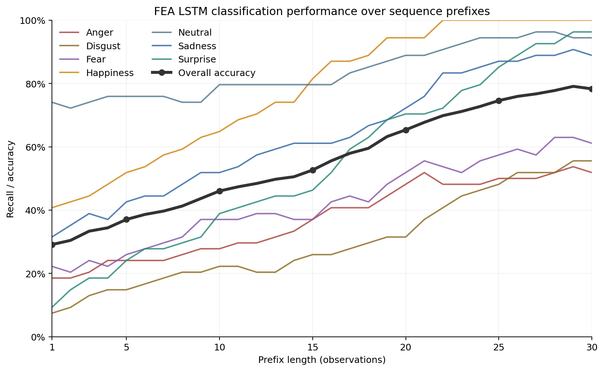

Class-specific recall trajectories with overall accuracy emphasized.

## Input integrity and provenance

All 11,340 rows form 378 complete 30-step trajectories, with 54 sequences per class and eight test participants. There are no missing values or duplicate sequence-step pairs. Labels, argmax predictions, true/max probability columns, correctness flags, sample IDs, and within-sequence timestamps are internally consistent. The largest probability-sum deviation is 2e-07. No model inference is rerun in this analysis notebook. The trajectory file includes observation timestamps, but prefixes are analyzed by observation count and are not aligned to expression phases. Raw FEA coefficients are not part of this trajectory file.

## Class-specific trajectories

Happiness reaches 54/54 correct predictions at the final prefix. Neutral, Sadness, and Surprise also reach high final recall, while Anger, Disgust, and Fear remain more variable. At one observation the model predicts Neutral for 162/378 sequences (42.86%), although only 54 sequences are Neutral. Early class recall should therefore be interpreted together with prediction composition. These are properties of the prefix probe and do not establish faster expression onset or class-specific physiological timing.

| Class | Recall, 1 observation | Recall, 30 observations | Never correct | Earlier correct, final wrong |
| --- | --- | --- | --- | --- |
| Anger | 18.52% | 51.85% | 19 | 7 |
| Disgust | 7.41% | 55.56% | 22 | 2 |
| Fear | 22.22% | 61.11% | 11 | 10 |
| Happiness | 40.74% | 100.00% | 0 | 0 |
| Neutral | 74.07% | 94.44% | 0 | 3 |
| Sadness | 31.48% | 88.89% | 5 | 1 |
| Surprise | 9.26% | 96.30% | 1 | 1 |

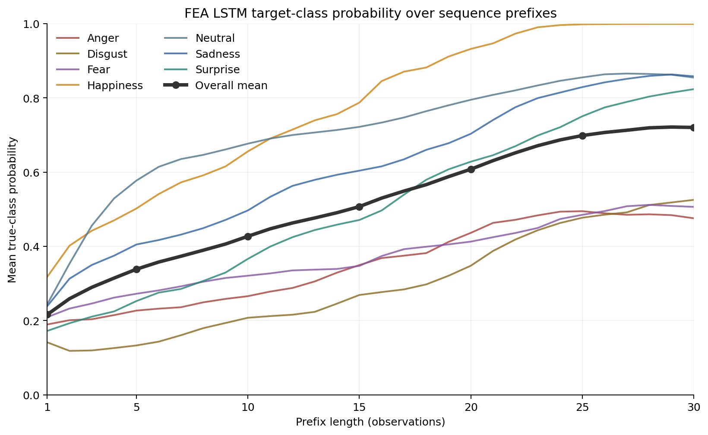

Mean probability of the ground-truth class for each expression and across all expressions.

## Final successes and final errors diverge over the prefix

For the 296 sequences that are correct at prefix 30, mean true-class probability rises from 0.237 at one observation to 0.890 at 30 observations. For the 82 final errors, mean true-class probability changes from 0.139 to 0.108. At the same time, mean maximum probability among those final errors rises from 0.379 to 0.807. Thus, unsuccessful trajectories are not simply low-confidence versions of successful trajectories; many become increasingly concentrated on an incorrect class. These groups are defined retrospectively by the final prediction and are therefore descriptive.

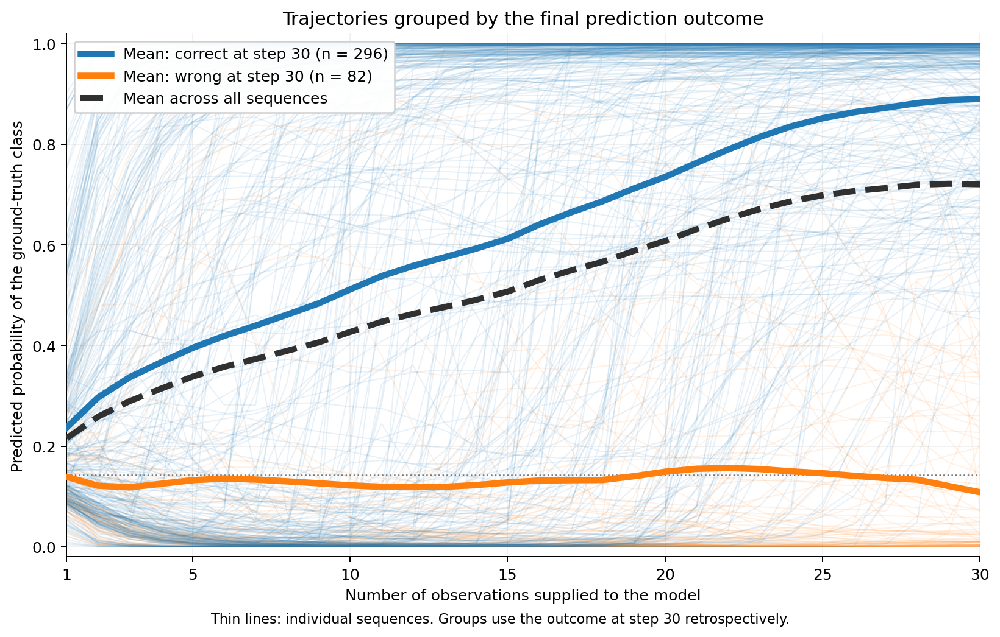

Mean true-class probability for all sequences, final successes, and final errors.

## Competing class hypotheses

The seven-output probability trajectories reveal which alternatives compete with the ground-truth class as more observations become available. At the final prefix, Anger remains closely opposed by Disgust, Fear is most strongly opposed by Surprise, and Disgust retains Happiness as its strongest mean competitor. Happiness, Neutral, Sadness, and Surprise show much clearer separation from their strongest alternatives by the end of the sequence. These probability patterns describe the classifier outputs and should not be interpreted as direct measurements of expression phases or muscle activation.

| True class | Mean true-class p, prefix 30 | Strongest competing class | Mean competing p, prefix 30 |
| --- | --- | --- | --- |
| Anger | 0.476 | Disgust | 0.442 |
| Disgust | 0.525 | Happiness | 0.177 |
| Fear | 0.506 | Surprise | 0.251 |
| Happiness | 0.999 | Anger | 0.000 |
| Neutral | 0.855 | Happiness | 0.052 |
| Sadness | 0.858 | Disgust | 0.070 |
| Surprise | 0.824 | Fear | 0.149 |

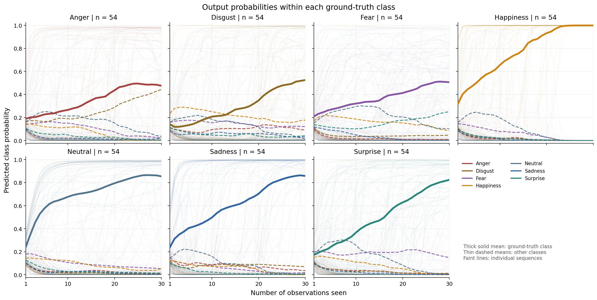

Mean output probabilities within each ground-truth class across the 30 sequence prefixes.

## Probability dynamics within final errors

Across the 82 sequences that remain wrong at prefix 30, the mean probability assigned to the eventual wrong class increases from 0.230 at one observation to 0.807 at 30 observations. Over the same interval, mean probability assigned to the true class changes from 0.139 to 0.108. The detailed class panels show that different error classes consolidate around different alternatives rather than following one common failure trajectory. This helps connect the temporal analysis to the final confusion patterns.

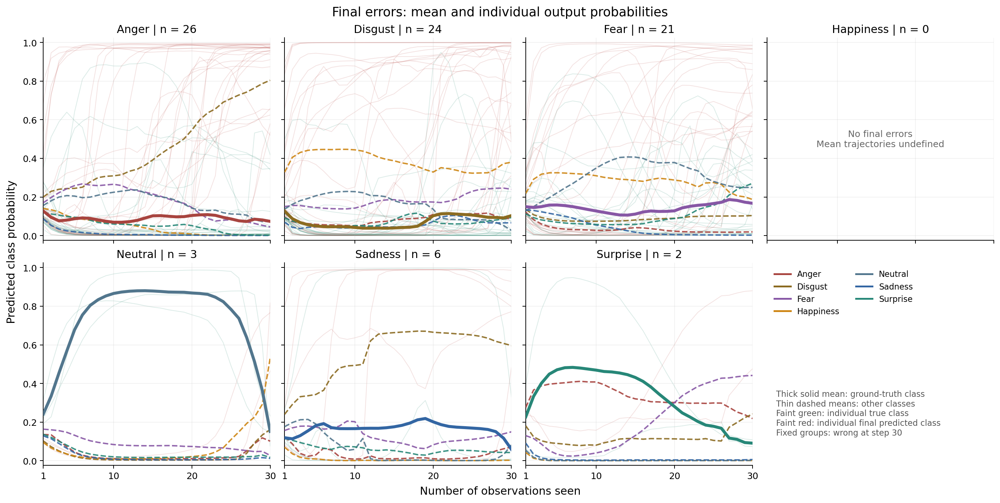

Output-probability trajectories for the fixed subset of sequences misclassified at prefix 30.

## Confidence is not equivalent to recognition

At prefix 10, mean maximum probability is 0.827, while accuracy is 46.03%. 87 wrong predictions already have maximum probability at least 0.90. At prefix 30, 41/82 final errors have maximum probability at least 0.90; mean maximum probability among final errors is 0.807. The softmax distribution can become sharply concentrated on the wrong class, so high maximum probability is not a validated accuracy guarantee.

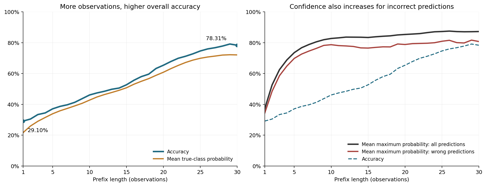

Accuracy, mean true-class probability, and maximum predicted probability are distinct descriptive measures.

## How class errors evolve

Recall generally improves with longer prefixes, but changes are class-dependent. The early excess of Neutral predictions decreases as other classes become more frequent. The final model still shows specific rather than uniformly distributed confusions. The four largest final off-diagonal counts are: Anger → Disgust: 23; Disgust → Happiness: 10; Fear → Surprise: 8; Disgust → Fear: 7.

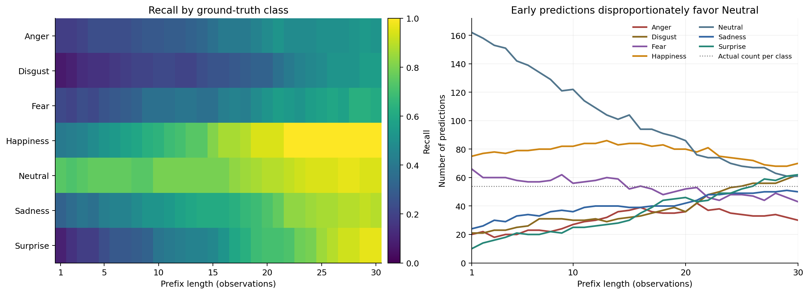

Per-class recall and predicted class frequencies across all 30 prefixes.

## Confusion matrices at fixed checkpoints

Prefixes 1, 10, 20, and 30 show the evolution of count-based confusion patterns without selecting a best-performing test prefix.

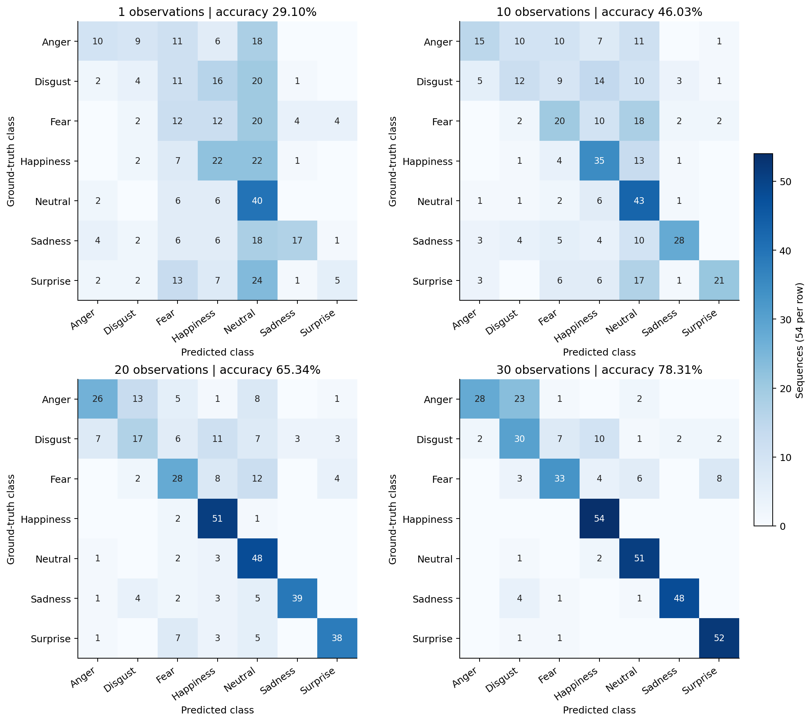

Counts; each row contains 54 sequences and all panels use the same color scale.

## Corrections, losses, and stability

From prefix 1 to 30, 195 initially wrong sequences become correct and 9 initially correct sequences become wrong. From prefix 20 to 30, there are 60 corrections and 11 losses, for a net gain of 49 sequences. 320/378 sequences are correct at least once; 24 of them end incorrectly. 58 sequences are never correct at any observed prefix. The median number of predicted-label switches is 1; 116 sequences never switch labels. Among the 296 final successes, the median first prefix from which all remaining predictions stay correct is 9. All persistence measures are retrospective and refer only to the observed 30-prefix interval.

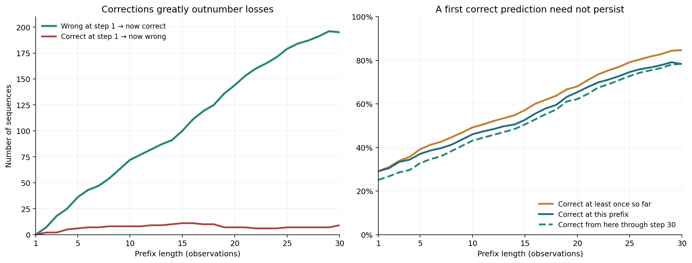

Cumulative success and retrospective stability measures.

## Illustrative individual sequences

Examples are chosen by a deterministic distance-to-group-mean rule over the complete seven-class probability trajectory. The groups illustrate stable success, recovery, transient success followed by failure, and persistent failure. They are descriptive examples, not evidence that a particular FEA coefficient caused the decision.

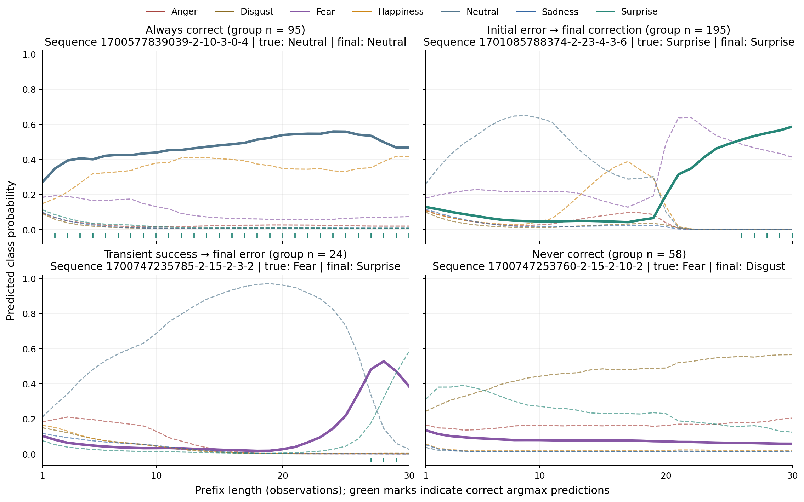

Thick solid line: ground-truth class. Dashed lines: other classes. Green marks: correct argmax predictions.

## Participant heterogeneity

All 8/8 participants have higher accuracy at prefix 30 than at prefix 1. The largest difference between pooled and equal-participant mean accuracy across the 30 prefixes is 0.64 percentage points. This is a descriptive check and does not establish population-level generalization or eliminate participant dependence.

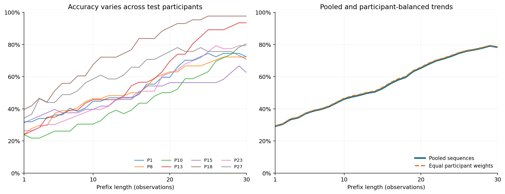

Participant IDs are read directly from the trajectory CSV.

## Interpretation and reporting limits

The highest observed prefix accuracy is 299/378 (79.10%) at prefix 29. This small nonmonotonicity is not a basis for selecting a new sequence length on the test set. The frozen classifier was optimized for complete sequences, so short prefixes may be outside its training distribution. Differences across prefixes combine changing available observations with changing recurrent state and do not by themselves isolate chronological order. The separate Ordered–Shuffled and Ordered–Mean ablations address that question. No expression phases were annotated; the first prefix is not necessarily a neutral onset and the last prefix is not necessarily an apex. No p-values are attached to the repeated descriptive prefix curves.

## Suggested use in the article

The combined class-wise recall / accuracy and true-class probability plots provide the most compact overview. The detailed class-probability grids are useful for inspecting competing output classes, while the confidence, stability, confusion, example, and participant views provide supplementary diagnostics. The prefix analysis complements rather than replaces the sequence-order ablation.
