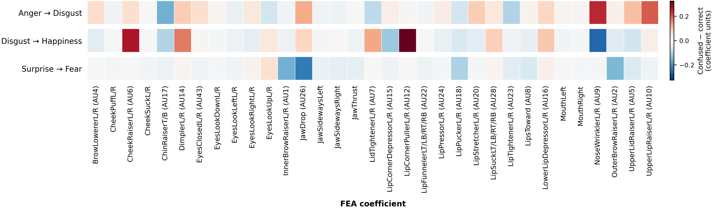

# Section 6.3 — Category and error-associated FEA profiles

Generated (UTC): 2026-10-06T19:54:50.519186+00:00

## Scope and validation

- Dynamic multimodal accuracy: 617/756 = 81.61%.
- Three named confusions: 84/139 errors = 60.43%.
- Category profiles: 1727 reenactments from 36 participants; splits: train, validation, test.
- Each raw channel is averaged over 30 steps; category means weight reenactments equally.
- Groups average their explicit constituents equally. No standardization or Neutral centering.
- Error profiles use test-only camera views. Shared FEA sequences can occur twice in one group or in both groups.
- Correct means source predicted as source; confused means source predicted as the named target. Other errors are excluded.
- Differences are confused minus correct, in coefficient units; relative changes are percentages of the correct-group mean.
- Mean filtering: None; AU exemption: True.
- Selected contrasts: top 8, ranked by absolute difference; ties resolved alphabetically.
- The shared-participant check deduplicates within each group and weights shared participants equally; it is descriptive.

## Reenactment counts by split

| category | train | validation | test |
| --- | --- | --- | --- |
| Anger | 66 | 55 | 54 |
| Disgust | 102 | 55 | 54 |
| Fear | 105 | 55 | 54 |
| Happiness | 191 | 55 | 54 |
| Neutral | 197 | 55 | 54 |
| Sadness | 131 | 55 | 54 |
| Surprise | 172 | 55 | 54 |

## Correct and confused group counts

| source | target | correct_views | correct_reenactments | correct_participants | confused_views | confused_reenactments | confused_participants | overlap_reenactments | shared_participants |
| --- | --- | --- | --- | --- | --- | --- | --- | --- | --- |
| Anger | Disgust | 60 | 34 | 7 | 44 | 26 | 7 | 8 | 6 |
| Disgust | Happiness | 72 | 39 | 8 | 20 | 11 | 3 | 2 | 3 |
| Surprise | Fear | 87 | 48 | 8 | 20 | 14 | 5 | 8 | 5 |

## Anger → Disgust

| rank | feature | semantic_facs_code | correct_mean | confused_mean | delta_raw | relative_change_percent | shared_participant_delta | sign_reversal | shared_participants |
| --- | --- | --- | --- | --- | --- | --- | --- | --- | --- |
| 1 | NoseWrinklerL/R | AU9 | 0.14387 | 0.38868 | 0.24482 | 170.16700 | 0.02012 | no | 6 |
| 2 | UpperLipRaiserL/R | AU10 | 0.17329 | 0.37186 | 0.19857 | 114.59092 | 0.01532 | no | 6 |
| 3 | ChinRaiserT/B | AU17 | 0.35287 | 0.19528 | -0.15759 | -44.65937 | -0.11069 | no | 6 |
| 4 | JawDrop | AU26 | 0.02004 | 0.14164 | 0.12160 | 606.72070 | 0.00931 | no | 6 |
| 5 | LipTightenerL/R | AU23 | 0.11599 | 0.01685 | -0.09914 | -85.47083 | 0.01118 | yes | 6 |
| 6 | UpperLidRaiserL/R | AU5 | 0.09725 | 0.19445 | 0.09720 | 99.95426 | 0.03661 | no | 6 |
| 7 | LidTightenerL/R | AU7 | 0.36435 | 0.27993 | -0.08442 | -23.16978 | -0.02124 | no | 6 |
| 8 | LipStretcherL/R | AU20 | 0.01250 | 0.09210 | 0.07960 | 636.76880 | 0.00617 | no | 6 |

## Disgust → Happiness

| rank | feature | semantic_facs_code | correct_mean | confused_mean | delta_raw | relative_change_percent | shared_participant_delta | sign_reversal | shared_participants |
| --- | --- | --- | --- | --- | --- | --- | --- | --- | --- |
| 1 | LipCornerPullerL/R | AU12 | 0.07103 | 0.39742 | 0.32639 | 459.49857 | 0.22683 | no | 3 |
| 2 | CheekRaiserL/R | AU6 | 0.25336 | 0.51947 | 0.26611 | 105.03445 | 0.09305 | no | 3 |
| 3 | NoseWrinklerL/R | AU9 | 0.32757 | 0.07168 | -0.25590 | -78.11919 | -0.15600 | no | 3 |
| 4 | DimplerL/R | AU14 | 0.07971 | 0.24811 | 0.16840 | 211.25554 | 0.14017 | no | 3 |
| 5 | LidTightenerL/R | AU7 | 0.28439 | 0.40950 | 0.12510 | 43.98982 | 0.16562 | no | 3 |
| 6 | LipCornerDepressorL/R | AU15 | 0.13224 | 0.01032 | -0.12192 | -92.19895 | -0.02014 | no | 3 |
| 7 | ChinRaiserT/B | AU17 | 0.16022 | 0.06202 | -0.09819 | -61.28828 | -0.15385 | no | 3 |
| 8 | LowerLipDepressorL/R | AU16 | 0.11123 | 0.19861 | 0.08738 | 78.56438 | 0.11974 | no | 3 |

## Surprise → Fear

| rank | feature | semantic_facs_code | correct_mean | confused_mean | delta_raw | relative_change_percent | shared_participant_delta | sign_reversal | shared_participants |
| --- | --- | --- | --- | --- | --- | --- | --- | --- | --- |
| 1 | JawDrop | AU26 | 0.43625 | 0.20751 | -0.22873 | -52.43228 | -0.05974 | no | 5 |
| 2 | InnerBrowRaiserL/R | AU1 | 0.32694 | 0.17062 | -0.15632 | -47.81297 | -0.07376 | no | 5 |
| 3 | OuterBrowRaiserL/R | AU2 | 0.33319 | 0.18639 | -0.14680 | -44.05790 | -0.08052 | no | 5 |
| 4 | LipPuckerL/R | AU18 | 0.12864 | 0.02564 | -0.10299 | -80.06683 | -0.10330 | no | 5 |
| 5 | EyesLookUpL/R | EYE63 | 0.03685 | 0.08746 | 0.05061 | 137.35844 | -0.01476 | yes | 5 |
| 6 | LipsToward | AU8 | 0.08921 | 0.03979 | -0.04942 | -55.39988 | -0.02367 | no | 5 |
| 7 | UpperLidRaiserL/R | AU5 | 0.31006 | 0.26448 | -0.04559 | -14.70320 | -0.06258 | no | 5 |
| 8 | LipTightenerL/R | AU23 | 0.03854 | 0.00375 | -0.03479 | -90.28167 | -0.03179 | no | 5 |

## Grouping definitions and retention

| group | semantic_facs_code | channels_averaged | n_channels | maximum_category_mean | is_au | passes_mean_filter | retained | retention_reason |
| --- | --- | --- | --- | --- | --- | --- | --- | --- |
| BrowLowererL/R | AU4 | BrowLowererL, BrowLowererR | 2 | 0.30116 | yes | yes | yes | filter disabled |
| CheekPuffL/R | AD34 | CheekPuffL, CheekPuffR | 2 | 0.01219 | no | yes | yes | filter disabled |
| CheekRaiserL/R | AU6 | CheekRaiserL, CheekRaiserR | 2 | 0.37581 | yes | yes | yes | filter disabled |
| CheekSuckL/R | AD35 | CheekSuckL, CheekSuckR | 2 | 0.00537 | no | yes | yes | filter disabled |
| ChinRaiserT/B | AU17 | ChinRaiserT, ChinRaiserB | 2 | 0.33795 | yes | yes | yes | filter disabled |
| DimplerL/R | AU14 | DimplerL, DimplerR | 2 | 0.20721 | yes | yes | yes | filter disabled |
| EyesClosedL/R | AU43 | EyesClosedL, EyesClosedR | 2 | 0.10012 | yes | yes | yes | filter disabled |
| EyesLookDownL/R | EYE64 | EyesLookDownL, EyesLookDownR | 2 | 0.08608 | no | yes | yes | filter disabled |
| EyesLookLeftL/R | EYE61 | EyesLookLeftL, EyesLookLeftR | 2 | 0.09796 | no | yes | yes | filter disabled |
| EyesLookRightL/R | EYE62 | EyesLookRightL, EyesLookRightR | 2 | 0.07500 | no | yes | yes | filter disabled |
| EyesLookUpL/R | EYE63 | EyesLookUpL, EyesLookUpR | 2 | 0.06909 | no | yes | yes | filter disabled |
| InnerBrowRaiserL/R | AU1 | InnerBrowRaiserL, InnerBrowRaiserR | 2 | 0.17547 | yes | yes | yes | filter disabled |
| JawDrop | AU26 | JawDrop | 1 | 0.32201 | yes | yes | yes | filter disabled |
| JawSidewaysLeft | AD30 | JawSidewaysLeft | 1 | 0.02003 | no | yes | yes | filter disabled |
| JawSidewaysRight | AD30 | JawSidewaysRight | 1 | 0.01921 | no | yes | yes | filter disabled |
| JawThrust | AD29 | JawThrust | 1 | 0.09760 | no | yes | yes | filter disabled |
| LidTightenerL/R | AU7 | LidTightenerL, LidTightenerR | 2 | 0.29379 | yes | yes | yes | filter disabled |
| LipCornerDepressorL/R | AU15 | LipCornerDepressorL, LipCornerDepressorR | 2 | 0.37740 | yes | yes | yes | filter disabled |
| LipCornerPullerL/R | AU12 | LipCornerPullerL, LipCornerPullerR | 2 | 0.49487 | yes | yes | yes | filter disabled |
| LipFunnelerLT/LB/RT/RB | AU22 | LipFunnelerLT, LipFunnelerLB, LipFunnelerRT, LipFunnelerRB | 4 | 0.04825 | yes | yes | yes | filter disabled |
| LipPressorL/R | AU24 | LipPressorL, LipPressorR | 2 | 0.01690 | yes | yes | yes | filter disabled |
| LipPuckerL/R | AU18 | LipPuckerL, LipPuckerR | 2 | 0.11062 | yes | yes | yes | filter disabled |
| LipStretcherL/R | AU20 | LipStretcherL, LipStretcherR | 2 | 0.06806 | yes | yes | yes | filter disabled |
| LipSuckLT/LB/RT/RB | AU28 | LipSuckLT, LipSuckLB, LipSuckRT, LipSuckRB | 4 | 0.13577 | yes | yes | yes | filter disabled |
| LipTightenerL/R | AU23 | LipTightenerL, LipTightenerR | 2 | 0.06930 | yes | yes | yes | filter disabled |
| LipsToward | AU8 | LipsToward | 1 | 0.06479 | yes | yes | yes | filter disabled |
| LowerLipDepressorL/R | AU16 | LowerLipDepressorL, LowerLipDepressorR | 2 | 0.12748 | yes | yes | yes | filter disabled |
| MouthLeft |  | MouthLeft | 1 | 0.01114 | no | yes | yes | filter disabled |
| MouthRight |  | MouthRight | 1 | 0.00340 | no | yes | yes | filter disabled |
| NoseWrinklerL/R | AU9 | NoseWrinklerL, NoseWrinklerR | 2 | 0.33854 | yes | yes | yes | filter disabled |
| OuterBrowRaiserL/R | AU2 | OuterBrowRaiserL, OuterBrowRaiserR | 2 | 0.17983 | yes | yes | yes | filter disabled |
| UpperLidRaiserL/R | AU5 | UpperLidRaiserL, UpperLidRaiserR | 2 | 0.22540 | yes | yes | yes | filter disabled |
| UpperLipRaiserL/R | AU10 | UpperLipRaiserL, UpperLipRaiserR | 2 | 0.28392 | yes | yes | yes | filter disabled |

## Figures

These are the compact producers for Figs. S6 and S7. Colors show raw means or signed differences, not percentages.

### Category profiles

Columns: 33; color limits: [(0.0, 0.49486882300560797)].

[PDF figure](03_category_profiles_compact.pdf)

### Confused-minus-correct profiles

Columns: 33; color limits: [(-0.32638759041960436, 0.32638759041960436), (-0.32638759041960436, 0.32638759041960436), (-0.32638759041960436, 0.32638759041960436)].

[PDF figure](04_confused_minus_correct_compact.pdf)

## Numerical exports

Complete tables retain all channels/groups regardless of top-N selection. Group definitions record any display filtering.

- [category_profiles_grouped.csv](category_profiles_grouped.csv)
- [category_profiles_raw.csv](category_profiles_raw.csv)
- [confusion_contrasts_grouped.csv](confusion_contrasts_grouped.csv)
- [confusion_contrasts_raw.csv](confusion_contrasts_raw.csv)
- [fea_group_definitions.csv](fea_group_definitions.csv)
- [confusion_group_counts.csv](confusion_group_counts.csv)
- [compact_selected_contrasts.csv](compact_selected_contrasts.csv)
- [compact_selected_components.csv](compact_selected_components.csv)

## Input provenance

| file | path | sha256 |
| --- | --- | --- |
| dynamic_test_predictions.csv | /workspace/repos/emohevrdb-dfer/5_dynamic_facial_expression_recognition/dynamic_test_predictions.csv | ac322c3232bd9a8bcb46f1be049233c2260b3193ebd19197c421ea372e007cde |
| training_set.csv | /workspace/datasets/emoji-hero-vr-db-dfea-as-csv/training_set.csv | cd316cf0c77c48127de38c4822aa073b0f15fdd13ecc619e4f189aaa270d5d1e |
| validation_set.csv | /workspace/datasets/emoji-hero-vr-db-dfea-as-csv/validation_set.csv | 8de231e80fdbe61d106b3fcf2c62565f3da710759bfe97e40a82b75f57a20e1c |
| test_set.csv | /workspace/datasets/emoji-hero-vr-db-dfea-as-csv/test_set.csv | cebe86d2fffb7b8446602247ad713d5d12e2c674837d9205e3d0c68cc496fcbf |
| facs_fea_mapping.json | /workspace/repos/emohevrdb-dfer/6_discussion/6_3_interpreting/facs_fea_mapping.json | a421cb17385b637f5d1b207407d1de5da9b1bbd4021a7c5a33118b3a30f70bb0 |

## Interpretation

- Proprietary FEAs are not validated AU measurements; FACS labels are semantic correspondences.
- Error-associated differences do not establish causal model reliance or incorrect benchmark labels.
- Repeated views, small participant groups, and shared-participant sign reversals constrain interpretation.
- Annotation agreement and dissenting-label matches belong in a separate annotation notebook.
