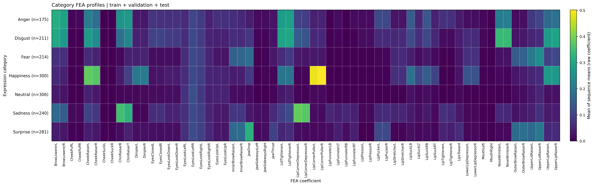
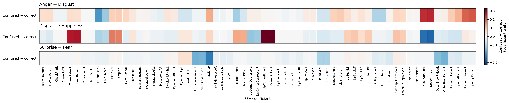
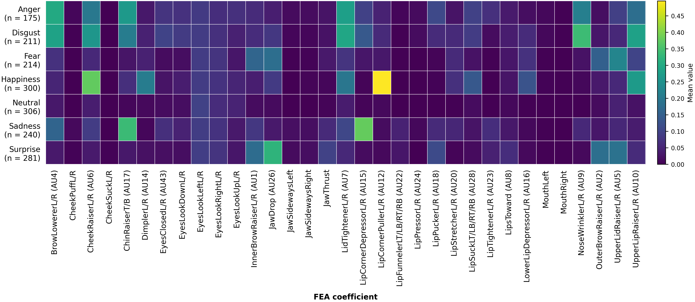

# Section 6.3 — FEA analysis results

Generated (UTC): 2026-09-28T18:54:30.463854+00:00

## 1. Results at a glance

- Multimodal test accuracy: **617/756 (81.61%)**; 378 reenactments, 8 participants.
- The selected confusions cover **84/139 errors (60.4%)** at the view level.
- Category profiles: **1727 reenactments, 36 participants**, using train, validation, test.
- Category-profile similarity rank **1/21: Fear / Surprise**, mean absolute difference **0.02409** across all 63 raw coefficients (lower is more similar).
- Category-profile similarity rank **2/21: Anger / Disgust**, mean absolute difference **0.02672** across all 63 raw coefficients (lower is more similar).
- **Anger / Disgust, top 10: 8/10 shared** (80.0%); different coefficient sets.
- **Anger / Disgust, top 20: 17/20 shared** (85.0%); different coefficient sets.
- **Fear / Surprise, top 10: 8/10 shared** (80.0%); different coefficient sets.
- **Fear / Surprise, top 20: 14/20 shared** (70.0%); different coefficient sets.
- Compact figures: **63 channels → 33 groups → 33 displayed columns**; mean filter disabled; all groups retained; AU exemption=True.
- Highest-ranked compact contrast, **Anger → Disgust: NoseWrinklerL/R (AU9)**, 0.3887 confused vs 0.1439 correct; **Δ=+0.2448** coefficient units.
- Highest-ranked compact contrast, **Disgust → Happiness: LipCornerPullerL/R (AU12)**, 0.3974 confused vs 0.0710 correct; **Δ=+0.3264** coefficient units.
- Highest-ranked compact contrast, **Surprise → Fear: JawDrop (AU26)**, 0.2075 confused vs 0.4362 correct; **Δ=-0.2287** coefficient units.
- Shared-participant sign reversals among selected compact contrasts: **Anger → Disgust: LipTightenerL/R; Surprise → Fear: EyesLookUpL/R**.

## 2. Scope, settings, and units

- Sequence means average each channel over 30 steps. Category means weight reenactments equally; no standardization or Neutral centering.
- Error analyses use test-only multimodal predictions (`multimodal_pred`), weighting each camera-view prediction equally.
- Correct = true source predicted as source; confused = true source predicted as the named target. Other errors are excluded.
- Two views share an FEA sequence. A reenactment may occur twice in one group or in both groups; observations are dependent.
- `delta_raw` = confused mean − correct mean, in coefficient units. Positive = higher in confused cases; negative = lower.
- Relative change (%) = 100 × delta_raw / correct mean; NA indicates a baseline below 0.01. This is not a percentage-point difference.
- The shared-participant check deduplicates reenactments within each group, calculates participant means, and weights shared participants equally.
- `sign_reversal=yes` means pooled and shared-participant deltas have opposite signs. NA indicates an unavailable check.
- Baseline ranking: top 8 by absolute delta; RANK_BILATERAL=True (the original 10 bilateral pairs).
- Compact ranking: top 8 by absolute delta; displayed groups only=True; 33 eligible groups. Exact ranking ties resolve alphabetically.
- Category top coefficients: 20; overlap cutoffs: [10, 20]; all 63 raw channels, independent of figure selection.
- Compact groups average their constituents equally within each sequence; grouping and filtering never affect the raw 63-channel similarity analysis.

### Dataset counts

Unique reenactments by split, not camera views.

| Category | train | validation | test |
| --- | --- | --- | --- |
| Anger | 66 | 55 | 54 |
| Disgust | 102 | 55 | 54 |
| Fear | 105 | 55 | 54 |
| Happiness | 191 | 55 | 54 |
| Neutral | 197 | 55 | 54 |
| Sadness | 131 | 55 | 54 |
| Surprise | 172 | 55 | 54 |

### Confusion group coverage

Reenactment overlap can occur when the two camera views receive different predictions.

| source | target | correct_views | correct_reenactments | correct_participants | confused_views | confused_reenactments | confused_participants | overlap_reenactments | shared_participants |
| --- | --- | --- | --- | --- | --- | --- | --- | --- | --- |
| Anger | Disgust | 60 | 34 | 7 | 44 | 26 | 7 | 8 | 6 |
| Disgust | Happiness | 72 | 39 | 8 | 20 | 11 | 3 | 2 | 3 |
| Surprise | Fear | 87 | 48 | 8 | 20 | 14 | 5 | 8 | 5 |

## 3. Pairwise similarity of raw category profiles

For each pair (a, b), distance = mean over all 63 channels of abs(category_mean[a] − category_mean[b]). Lower values mean more similar category-average profiles. All channels have equal weight; left/right channels remain separate. This is a distance between means, not the average distance between individual samples, and does not describe within-class variation.

| rank | first_category | second_category | mean_absolute_difference |
| --- | --- | --- | --- |
| 1 | Fear | Surprise | 0.02409 |
| 2 | Anger | Disgust | 0.02672 |
| 3 | Fear | Neutral | 0.03357 |
| 4 | Neutral | Surprise | 0.03526 |
| 5 | Neutral | Sadness | 0.05101 |
| 6 | Anger | Sadness | 0.05159 |
| 7 | Sadness | Surprise | 0.05751 |
| 8 | Fear | Sadness | 0.05770 |
| 9 | Disgust | Sadness | 0.06277 |
| 10 | Happiness | Neutral | 0.06653 |
| 11 | Disgust | Happiness | 0.06707 |
| 12 | Fear | Happiness | 0.06809 |
| 13 | Anger | Neutral | 0.06818 |
| 14 | Anger | Fear | 0.07043 |
| 15 | Disgust | Fear | 0.07314 |
| 16 | Anger | Surprise | 0.07406 |
| 17 | Anger | Happiness | 0.07580 |
| 18 | Disgust | Neutral | 0.07652 |
| 19 | Happiness | Surprise | 0.08620 |
| 20 | Disgust | Surprise | 0.08826 |
| 21 | Happiness | Sadness | 0.09075 |

### Largest coefficient differences: Anger / Disgust

The signed difference is second_category − first_category, following the table columns; ranking uses its absolute value.

| first_category | second_category | coefficient | first_category_mean | second_category_mean | signed_difference_second_minus_first | absolute_difference |
| --- | --- | --- | --- | --- | --- | --- |
| Anger | Disgust | NoseWrinklerL | 0.21238 | 0.33790 | 0.12552 | 0.12552 |
| Anger | Disgust | NoseWrinklerR | 0.21381 | 0.33918 | 0.12537 | 0.12537 |
| Anger | Disgust | UpperLipRaiserR | 0.18627 | 0.29184 | 0.10557 | 0.10557 |
| Anger | Disgust | UpperLipRaiserL | 0.17269 | 0.27599 | 0.10330 | 0.10330 |
| Anger | Disgust | ChinRaiserB | 0.25892 | 0.18395 | -0.07496 | 0.07496 |
| Anger | Disgust | CheekRaiserL | 0.21204 | 0.27620 | 0.06416 | 0.06416 |
| Anger | Disgust | CheekRaiserR | 0.18246 | 0.24324 | 0.06078 | 0.06078 |
| Anger | Disgust | LipTightenerL | 0.07105 | 0.01677 | -0.05428 | 0.05428 |
| Anger | Disgust | LipTightenerR | 0.06755 | 0.01462 | -0.05293 | 0.05293 |
| Anger | Disgust | LipPuckerL | 0.11100 | 0.06204 | -0.04896 | 0.04896 |

## 4. Top-coefficient overlap and category rankings

Overlap (%) = intersection size / cutoff × 100; Jaccard (%) = intersection size / union size × 100. Identical sets ignore order; identical order also requires matching ranks. Shared membership does not imply equal coefficient values.

| pair | top_n | shared_count | overlap_percent | jaccard_percent | identical_sets | identical_order | shared_coefficients |
| --- | --- | --- | --- | --- | --- | --- | --- |
| Anger / Disgust | 10 | 8 | 80.00000 | 66.66667 | no | no | BrowLowererL, BrowLowererR, LidTightenerR, LidTightenerL, NoseWrinklerR, NoseWrinklerL, CheekRaiserL, UpperLipRaiserR |
| Anger / Disgust | 20 | 17 | 85.00000 | 73.91304 | no | no | BrowLowererL, BrowLowererR, LidTightenerR, LidTightenerL, ChinRaiserT, ChinRaiserB, NoseWrinklerR, NoseWrinklerL, CheekRaiserL, UpperLipRaiserR, CheekRaiserR, UpperLipRaiserL, LipSuckLB, LipSuckRB, EyesLookLeftR, LipCornerDepressorL, LipCornerDepressorR |
| Fear / Surprise | 10 | 8 | 80.00000 | 66.66667 | no | no | UpperLidRaiserR, UpperLidRaiserL, JawDrop, InnerBrowRaiserR, OuterBrowRaiserR, InnerBrowRaiserL, OuterBrowRaiserL, EyesLookLeftR |
| Fear / Surprise | 20 | 14 | 70.00000 | 53.84615 | no | no | UpperLidRaiserR, UpperLidRaiserL, JawDrop, InnerBrowRaiserR, OuterBrowRaiserR, InnerBrowRaiserL, OuterBrowRaiserL, EyesLookLeftR, UpperLipRaiserR, UpperLipRaiserL, EyesLookRightL, LidTightenerR, EyesLookLeftL, LidTightenerL |

### Anger: top 20

High raw means do not establish discriminative importance.

| rank | feature | mean_sequence_mean |
| --- | --- | --- |
| 1 | BrowLowererL | 0.31233 |
| 2 | BrowLowererR | 0.28999 |
| 3 | LidTightenerR | 0.28245 |
| 4 | LidTightenerL | 0.27545 |
| 5 | ChinRaiserT | 0.27075 |
| 6 | ChinRaiserB | 0.25892 |
| 7 | NoseWrinklerR | 0.21381 |
| 8 | NoseWrinklerL | 0.21238 |
| 9 | CheekRaiserL | 0.21204 |
| 10 | UpperLipRaiserR | 0.18627 |
| 11 | CheekRaiserR | 0.18246 |
| 12 | UpperLipRaiserL | 0.17269 |
| 13 | LipSuckLB | 0.14658 |
| 14 | LipSuckRB | 0.13654 |
| 15 | LipPuckerL | 0.11100 |
| 16 | LipPuckerR | 0.10833 |
| 17 | EyesLookLeftR | 0.10718 |
| 18 | UpperLidRaiserR | 0.10465 |
| 19 | LipCornerDepressorL | 0.09969 |
| 20 | LipCornerDepressorR | 0.09079 |

### Disgust: top 20

High raw means do not establish discriminative importance.

| rank | feature | mean_sequence_mean |
| --- | --- | --- |
| 1 | NoseWrinklerR | 0.33918 |
| 2 | NoseWrinklerL | 0.33790 |
| 3 | BrowLowererL | 0.30217 |
| 4 | LidTightenerR | 0.29465 |
| 5 | LidTightenerL | 0.29293 |
| 6 | UpperLipRaiserR | 0.29184 |
| 7 | CheekRaiserL | 0.27620 |
| 8 | UpperLipRaiserL | 0.27599 |
| 9 | BrowLowererR | 0.26961 |
| 10 | CheekRaiserR | 0.24324 |
| 11 | ChinRaiserT | 0.23087 |
| 12 | ChinRaiserB | 0.18395 |
| 13 | LipCornerDepressorL | 0.14599 |
| 14 | LipCornerDepressorR | 0.13133 |
| 15 | LipSuckLB | 0.11609 |
| 16 | EyesLookLeftR | 0.11252 |
| 17 | LipSuckRB | 0.10665 |
| 18 | EyesClosedR | 0.10194 |
| 19 | EyesClosedL | 0.09831 |
| 20 | EyesLookRightL | 0.08856 |

### Fear: top 20

High raw means do not establish discriminative importance.

| rank | feature | mean_sequence_mean |
| --- | --- | --- |
| 1 | UpperLidRaiserR | 0.24603 |
| 2 | UpperLidRaiserL | 0.20476 |
| 3 | JawDrop | 0.17848 |
| 4 | InnerBrowRaiserR | 0.16552 |
| 5 | OuterBrowRaiserR | 0.15849 |
| 6 | InnerBrowRaiserL | 0.15656 |
| 7 | OuterBrowRaiserL | 0.14360 |
| 8 | EyesLookLeftR | 0.11032 |
| 9 | UpperLipRaiserR | 0.10633 |
| 10 | UpperLipRaiserL | 0.09727 |
| 11 | EyesLookRightL | 0.09445 |
| 12 | LidTightenerR | 0.08474 |
| 13 | BrowLowererL | 0.07187 |
| 14 | LowerLipDepressorL | 0.07126 |
| 15 | LowerLipDepressorR | 0.07102 |
| 16 | BrowLowererR | 0.06804 |
| 17 | EyesLookLeftL | 0.06385 |
| 18 | LidTightenerL | 0.06370 |
| 19 | CheekRaiserL | 0.06171 |
| 20 | LipStretcherR | 0.06067 |

### Happiness: top 20

High raw means do not establish discriminative importance.

| rank | feature | mean_sequence_mean |
| --- | --- | --- |
| 1 | LipCornerPullerR | 0.50186 |
| 2 | LipCornerPullerL | 0.48788 |
| 3 | CheekRaiserL | 0.38112 |
| 4 | CheekRaiserR | 0.37049 |
| 5 | UpperLipRaiserL | 0.27244 |
| 6 | UpperLipRaiserR | 0.26605 |
| 7 | DimplerR | 0.21084 |
| 8 | DimplerL | 0.20358 |
| 9 | LidTightenerL | 0.19489 |
| 10 | LidTightenerR | 0.19310 |
| 11 | LipSuckLB | 0.18708 |
| 12 | LipSuckRB | 0.14837 |
| 13 | LowerLipDepressorL | 0.13013 |
| 14 | LowerLipDepressorR | 0.12483 |
| 15 | EyesLookLeftR | 0.11175 |
| 16 | LipSuckLT | 0.10866 |
| 17 | LipSuckRT | 0.09897 |
| 18 | ChinRaiserT | 0.09621 |
| 19 | EyesLookRightL | 0.09292 |
| 20 | JawDrop | 0.08429 |

### Neutral: top 20

High raw means do not establish discriminative importance.

| rank | feature | mean_sequence_mean |
| --- | --- | --- |
| 1 | EyesLookLeftR | 0.12200 |
| 2 | EyesLookRightL | 0.08222 |
| 3 | EyesLookLeftL | 0.07392 |
| 4 | UpperLidRaiserR | 0.05450 |
| 5 | EyesLookUpR | 0.04859 |
| 6 | EyesLookUpL | 0.04859 |
| 7 | CheekRaiserL | 0.04523 |
| 8 | EyesLookRightR | 0.04391 |
| 9 | LidTightenerR | 0.04299 |
| 10 | BrowLowererL | 0.03650 |
| 11 | UpperLidRaiserL | 0.03459 |
| 12 | CheekRaiserR | 0.03372 |
| 13 | LidTightenerL | 0.03235 |
| 14 | BrowLowererR | 0.02908 |
| 15 | LipSuckLB | 0.02441 |
| 16 | UpperLipRaiserR | 0.02373 |
| 17 | UpperLipRaiserL | 0.02296 |
| 18 | LipSuckRB | 0.01941 |
| 19 | EyesLookDownL | 0.01850 |
| 20 | EyesLookDownR | 0.01785 |

### Sadness: top 20

High raw means do not establish discriminative importance.

| rank | feature | mean_sequence_mean |
| --- | --- | --- |
| 1 | LipCornerDepressorL | 0.38327 |
| 2 | LipCornerDepressorR | 0.37153 |
| 3 | ChinRaiserB | 0.35097 |
| 4 | ChinRaiserT | 0.32493 |
| 5 | BrowLowererL | 0.17100 |
| 6 | BrowLowererR | 0.14614 |
| 7 | LidTightenerR | 0.11523 |
| 8 | EyesLookLeftR | 0.11369 |
| 9 | CheekRaiserL | 0.09695 |
| 10 | LidTightenerL | 0.09401 |
| 11 | EyesLookRightL | 0.09312 |
| 12 | InnerBrowRaiserL | 0.08145 |
| 13 | InnerBrowRaiserR | 0.08070 |
| 14 | CheekRaiserR | 0.07958 |
| 15 | EyesClosedR | 0.06967 |
| 16 | UpperLidRaiserR | 0.06885 |
| 17 | EyesLookLeftL | 0.06742 |
| 18 | LipTightenerL | 0.06677 |
| 19 | EyesClosedL | 0.06378 |
| 20 | LipTightenerR | 0.06252 |

### Surprise: top 20

High raw means do not establish discriminative importance.

| rank | feature | mean_sequence_mean |
| --- | --- | --- |
| 1 | JawDrop | 0.32201 |
| 2 | UpperLidRaiserR | 0.20138 |
| 3 | OuterBrowRaiserR | 0.18622 |
| 4 | InnerBrowRaiserR | 0.17827 |
| 5 | OuterBrowRaiserL | 0.17343 |
| 6 | InnerBrowRaiserL | 0.17267 |
| 7 | UpperLidRaiserL | 0.17106 |
| 8 | EyesLookLeftR | 0.11513 |
| 9 | LipPuckerR | 0.11136 |
| 10 | LipPuckerL | 0.10988 |
| 11 | JawThrust | 0.09760 |
| 12 | EyesLookRightL | 0.09499 |
| 13 | EyesLookLeftL | 0.06837 |
| 14 | LipsToward | 0.06479 |
| 15 | LidTightenerR | 0.06406 |
| 16 | UpperLipRaiserR | 0.06261 |
| 17 | UpperLipRaiserL | 0.05807 |
| 18 | EyesLookRightR | 0.05502 |
| 19 | LidTightenerL | 0.05132 |
| 20 | LipTightenerL | 0.04959 |

## 5. Compact contrasts — numerical companion to the compact figures

Top 8 per confusion by absolute delta, using the same within-sequence averages as the compact heatmaps. The component tables expose changes concealed by averaging. The participant check is descriptive; no significance tests are implied.

### Anger → Disgust

| rank | feature | semantic_facs_code | correct_mean | confused_mean | delta_raw | relative_change_percent | shared_participant_delta | sign_reversal | shared_participants |
| --- | --- | --- | --- | --- | --- | --- | --- | --- | --- |
| 1 | NoseWrinklerL/R | AU9 | 0.14387 | 0.38868 | 0.24482 | 170.16700 | 0.02012 | no | 6 |
| 2 | UpperLipRaiserL/R | AU10 | 0.17329 | 0.37186 | 0.19857 | 114.59092 | 0.01532 | no | 6 |
| 3 | ChinRaiserT/B | AU17 | 0.35287 | 0.19528 | -0.15759 | -44.65937 | -0.11069 | no | 6 |
| 4 | JawDrop | AU26 | 0.02004 | 0.14164 | 0.12160 | 606.72070 | 0.00931 | no | 6 |
| 5 | LipTightenerL/R | AU23 | 0.11599 | 0.01685 | -0.09914 | -85.47083 | 0.01118 | yes | 6 |
| 6 | UpperLidRaiserL/R | AU5 | 0.09725 | 0.19445 | 0.09720 | 99.95426 | 0.03661 | no | 6 |
| 7 | LidTightenerL/R | AU7 | 0.36435 | 0.27993 | -0.08442 | -23.16978 | -0.02124 | no | 6 |
| 8 | LipStretcherL/R | AU20 | 0.01250 | 0.09210 | 0.07960 | 636.76880 | 0.00617 | no | 6 |

Constituent channels behind selected averages:

| rank | selected_measure | feature | correct_mean | confused_mean | delta_raw | relative_change_percent |
| --- | --- | --- | --- | --- | --- | --- |
| 1 | NoseWrinklerL/R | NoseWrinklerL | 0.14429 | 0.38725 | 0.24296 | 168.37533 |
| 1 | NoseWrinklerL/R | NoseWrinklerR | 0.14344 | 0.39012 | 0.24667 | 171.96933 |
| 2 | UpperLipRaiserL/R | UpperLipRaiserL | 0.16709 | 0.36109 | 0.19400 | 116.10778 |
| 2 | UpperLipRaiserL/R | UpperLipRaiserR | 0.17949 | 0.38263 | 0.20314 | 113.17882 |
| 3 | ChinRaiserT/B | ChinRaiserB | 0.34897 | 0.15659 | -0.19237 | -55.12686 |
| 3 | ChinRaiserT/B | ChinRaiserT | 0.35677 | 0.23396 | -0.12280 | -34.42067 |
| 5 | LipTightenerL/R | LipTightenerL | 0.11706 | 0.01779 | -0.09927 | -84.80300 |
| 5 | LipTightenerL/R | LipTightenerR | 0.11493 | 0.01592 | -0.09902 | -86.15099 |
| 6 | UpperLidRaiserL/R | UpperLidRaiserL | 0.09002 | 0.17116 | 0.08115 | 90.14536 |
| 6 | UpperLidRaiserL/R | UpperLidRaiserR | 0.10448 | 0.21774 | 0.11326 | 108.40522 |
| 7 | LidTightenerL/R | LidTightenerL | 0.36758 | 0.25628 | -0.11130 | -30.27957 |
| 7 | LidTightenerL/R | LidTightenerR | 0.36113 | 0.30359 | -0.05754 | -15.93297 |
| 8 | LipStretcherL/R | LipStretcherL | 0.01288 | 0.08985 | 0.07697 | 597.65668 |
| 8 | LipStretcherL/R | LipStretcherR | 0.01212 | 0.09436 | 0.08223 | 678.32031 |

### Disgust → Happiness

| rank | feature | semantic_facs_code | correct_mean | confused_mean | delta_raw | relative_change_percent | shared_participant_delta | sign_reversal | shared_participants |
| --- | --- | --- | --- | --- | --- | --- | --- | --- | --- |
| 1 | LipCornerPullerL/R | AU12 | 0.07103 | 0.39742 | 0.32639 | 459.49857 | 0.22683 | no | 3 |
| 2 | CheekRaiserL/R | AU6 | 0.25336 | 0.51947 | 0.26611 | 105.03445 | 0.09305 | no | 3 |
| 3 | NoseWrinklerL/R | AU9 | 0.32757 | 0.07168 | -0.25590 | -78.11919 | -0.15600 | no | 3 |
| 4 | DimplerL/R | AU14 | 0.07971 | 0.24811 | 0.16840 | 211.25554 | 0.14017 | no | 3 |
| 5 | LidTightenerL/R | AU7 | 0.28439 | 0.40950 | 0.12510 | 43.98982 | 0.16562 | no | 3 |
| 6 | LipCornerDepressorL/R | AU15 | 0.13224 | 0.01032 | -0.12192 | -92.19895 | -0.02014 | no | 3 |
| 7 | ChinRaiserT/B | AU17 | 0.16022 | 0.06202 | -0.09819 | -61.28828 | -0.15385 | no | 3 |
| 8 | LowerLipDepressorL/R | AU16 | 0.11123 | 0.19861 | 0.08738 | 78.56438 | 0.11974 | no | 3 |

Constituent channels behind selected averages:

| rank | selected_measure | feature | correct_mean | confused_mean | delta_raw | relative_change_percent |
| --- | --- | --- | --- | --- | --- | --- |
| 1 | LipCornerPullerL/R | LipCornerPullerL | 0.07064 | 0.39475 | 0.32411 | 458.83858 |
| 1 | LipCornerPullerL/R | LipCornerPullerR | 0.07142 | 0.40009 | 0.32866 | 460.15128 |
| 2 | CheekRaiserL/R | CheekRaiserL | 0.26825 | 0.53093 | 0.26268 | 97.92565 |
| 2 | CheekRaiserL/R | CheekRaiserR | 0.23847 | 0.50801 | 0.26954 | 113.03090 |
| 3 | NoseWrinklerL/R | NoseWrinklerL | 0.32573 | 0.07808 | -0.24765 | -76.02941 |
| 3 | NoseWrinklerL/R | NoseWrinklerR | 0.32941 | 0.06527 | -0.26414 | -80.18559 |
| 4 | DimplerL/R | DimplerL | 0.07954 | 0.24991 | 0.17037 | 214.19234 |
| 4 | DimplerL/R | DimplerR | 0.07989 | 0.24631 | 0.16643 | 208.33148 |
| 5 | LidTightenerL/R | LidTightenerL | 0.29012 | 0.41784 | 0.12773 | 44.02701 |
| 5 | LidTightenerL/R | LidTightenerR | 0.27867 | 0.40115 | 0.12248 | 43.95110 |
| 6 | LipCornerDepressorL/R | LipCornerDepressorL | 0.14321 | 0.01590 | -0.12731 | -88.89579 |
| 6 | LipCornerDepressorL/R | LipCornerDepressorR | 0.12127 | 0.00473 | -0.11654 | -96.09977 |
| 7 | ChinRaiserT/B | ChinRaiserB | 0.12579 | 0.02168 | -0.10411 | -82.76256 |
| 7 | ChinRaiserT/B | ChinRaiserT | 0.19465 | 0.10236 | -0.09228 | -47.41048 |
| 8 | LowerLipDepressorL/R | LowerLipDepressorL | 0.11169 | 0.20524 | 0.09355 | 83.75825 |
| 8 | LowerLipDepressorL/R | LowerLipDepressorR | 0.11076 | 0.19198 | 0.08122 | 73.32687 |

### Surprise → Fear

| rank | feature | semantic_facs_code | correct_mean | confused_mean | delta_raw | relative_change_percent | shared_participant_delta | sign_reversal | shared_participants |
| --- | --- | --- | --- | --- | --- | --- | --- | --- | --- |
| 1 | JawDrop | AU26 | 0.43625 | 0.20751 | -0.22873 | -52.43228 | -0.05974 | no | 5 |
| 2 | InnerBrowRaiserL/R | AU1 | 0.32694 | 0.17062 | -0.15632 | -47.81297 | -0.07376 | no | 5 |
| 3 | OuterBrowRaiserL/R | AU2 | 0.33319 | 0.18639 | -0.14680 | -44.05790 | -0.08052 | no | 5 |
| 4 | LipPuckerL/R | AU18 | 0.12864 | 0.02564 | -0.10299 | -80.06683 | -0.10330 | no | 5 |
| 5 | EyesLookUpL/R | EYE63 | 0.03685 | 0.08746 | 0.05061 | 137.35844 | -0.01476 | yes | 5 |
| 6 | LipsToward | AU8 | 0.08921 | 0.03979 | -0.04942 | -55.39988 | -0.02367 | no | 5 |
| 7 | UpperLidRaiserL/R | AU5 | 0.31006 | 0.26448 | -0.04559 | -14.70320 | -0.06258 | no | 5 |
| 8 | LipTightenerL/R | AU23 | 0.03854 | 0.00375 | -0.03479 | -90.28167 | -0.03179 | no | 5 |

Constituent channels behind selected averages:

| rank | selected_measure | feature | correct_mean | confused_mean | delta_raw | relative_change_percent |
| --- | --- | --- | --- | --- | --- | --- |
| 2 | InnerBrowRaiserL/R | InnerBrowRaiserL | 0.32523 | 0.16632 | -0.15890 | -48.85923 |
| 2 | InnerBrowRaiserL/R | InnerBrowRaiserR | 0.32865 | 0.17491 | -0.15373 | -46.77760 |
| 3 | OuterBrowRaiserL/R | OuterBrowRaiserL | 0.32693 | 0.18780 | -0.13913 | -42.55581 |
| 3 | OuterBrowRaiserL/R | OuterBrowRaiserR | 0.33945 | 0.18498 | -0.15447 | -45.50461 |
| 4 | LipPuckerL/R | LipPuckerL | 0.12773 | 0.02474 | -0.10298 | -80.62941 |
| 4 | LipPuckerL/R | LipPuckerR | 0.12954 | 0.02654 | -0.10300 | -79.51215 |
| 5 | EyesLookUpL/R | EyesLookUpL | 0.03682 | 0.08718 | 0.05036 | 136.75726 |
| 5 | EyesLookUpL/R | EyesLookUpR | 0.03687 | 0.08774 | 0.05087 | 137.95885 |
| 7 | UpperLidRaiserL/R | UpperLidRaiserL | 0.26884 | 0.22651 | -0.04233 | -15.74642 |
| 7 | UpperLidRaiserL/R | UpperLidRaiserR | 0.35129 | 0.30244 | -0.04885 | -13.90484 |
| 8 | LipTightenerL/R | LipTightenerL | 0.04354 | 0.00431 | -0.03923 | -90.10850 |
| 8 | LipTightenerL/R | LipTightenerR | 0.03354 | 0.00318 | -0.03036 | -90.50644 |

## 6. Compact grouping and retention

- Filter: disabled; all groups retained; evaluated using train, validation, test.
- KEEP_ALL_AU_GROUPS=True: AU groups bypass an active threshold.
- Only AU-prefixed codes qualify for exemption; AD and eye-position codes do not. Exemption is independent of showing AU labels.
- LipFunnelerLT/LB/RT/RB and LipSuckLT/LB/RT/RB average four explicit components; ChinRaiserT/B averages two. Opposing directions stay separate.
- Both compact figures use the same retained groups in the same order. A low category mean does not prove a movement is uninformative for errors.
- Removed groups: none.

| group | semantic_facs_code | channels_averaged | n_channels | maximum_category_mean | is_au | passes_mean_filter | retained | retention_reason |
| --- | --- | --- | --- | --- | --- | --- | --- | --- |
| BrowLowererL/R | AU4 | BrowLowererL, BrowLowererR | 2 | 0.30116 | yes | yes | yes | filter disabled |
| CheekPuffL/R | AD34 | CheekPuffL, CheekPuffR | 2 | 0.01219 | no | yes | yes | filter disabled |
| CheekRaiserL/R | AU6 | CheekRaiserL, CheekRaiserR | 2 | 0.37581 | yes | yes | yes | filter disabled |
| CheekSuckL/R | AD35 | CheekSuckL, CheekSuckR | 2 | 0.00537 | no | yes | yes | filter disabled |
| ChinRaiserT/B | AU17 | ChinRaiserT, ChinRaiserB | 2 | 0.33795 | yes | yes | yes | filter disabled |
| DimplerL/R | AU14 | DimplerL, DimplerR | 2 | 0.20721 | yes | yes | yes | filter disabled |
| EyesClosedL/R | AU43 | EyesClosedL, EyesClosedR | 2 | 0.10012 | yes | yes | yes | filter disabled |
| EyesLookDownL/R | EYE64 | EyesLookDownL, EyesLookDownR | 2 | 0.08608 | no | yes | yes | filter disabled |
| EyesLookLeftL/R | EYE61 | EyesLookLeftL, EyesLookLeftR | 2 | 0.09796 | no | yes | yes | filter disabled |
| EyesLookRightL/R | EYE62 | EyesLookRightL, EyesLookRightR | 2 | 0.07500 | no | yes | yes | filter disabled |
| EyesLookUpL/R | EYE63 | EyesLookUpL, EyesLookUpR | 2 | 0.06909 | no | yes | yes | filter disabled |
| InnerBrowRaiserL/R | AU1 | InnerBrowRaiserL, InnerBrowRaiserR | 2 | 0.17547 | yes | yes | yes | filter disabled |
| JawDrop | AU26 | JawDrop | 1 | 0.32201 | yes | yes | yes | filter disabled |
| JawSidewaysLeft | AD30 | JawSidewaysLeft | 1 | 0.02003 | no | yes | yes | filter disabled |
| JawSidewaysRight | AD30 | JawSidewaysRight | 1 | 0.01921 | no | yes | yes | filter disabled |
| JawThrust | AD29 | JawThrust | 1 | 0.09760 | no | yes | yes | filter disabled |
| LidTightenerL/R | AU7 | LidTightenerL, LidTightenerR | 2 | 0.29379 | yes | yes | yes | filter disabled |
| LipCornerDepressorL/R | AU15 | LipCornerDepressorL, LipCornerDepressorR | 2 | 0.37740 | yes | yes | yes | filter disabled |
| LipCornerPullerL/R | AU12 | LipCornerPullerL, LipCornerPullerR | 2 | 0.49487 | yes | yes | yes | filter disabled |
| LipFunnelerLT/LB/RT/RB | AU22 | LipFunnelerLT, LipFunnelerLB, LipFunnelerRT, LipFunnelerRB | 4 | 0.04825 | yes | yes | yes | filter disabled |
| LipPressorL/R | AU24 | LipPressorL, LipPressorR | 2 | 0.01690 | yes | yes | yes | filter disabled |
| LipPuckerL/R | AU18 | LipPuckerL, LipPuckerR | 2 | 0.11062 | yes | yes | yes | filter disabled |
| LipStretcherL/R | AU20 | LipStretcherL, LipStretcherR | 2 | 0.06806 | yes | yes | yes | filter disabled |
| LipSuckLT/LB/RT/RB | AU28 | LipSuckLT, LipSuckLB, LipSuckRT, LipSuckRB | 4 | 0.13577 | yes | yes | yes | filter disabled |
| LipTightenerL/R | AU23 | LipTightenerL, LipTightenerR | 2 | 0.06930 | yes | yes | yes | filter disabled |
| LipsToward | AU8 | LipsToward | 1 | 0.06479 | yes | yes | yes | filter disabled |
| LowerLipDepressorL/R | AU16 | LowerLipDepressorL, LowerLipDepressorR | 2 | 0.12748 | yes | yes | yes | filter disabled |
| MouthLeft |  | MouthLeft | 1 | 0.01114 | no | yes | yes | filter disabled |
| MouthRight |  | MouthRight | 1 | 0.00340 | no | yes | yes | filter disabled |
| NoseWrinklerL/R | AU9 | NoseWrinklerL, NoseWrinklerR | 2 | 0.33854 | yes | yes | yes | filter disabled |
| OuterBrowRaiserL/R | AU2 | OuterBrowRaiserL, OuterBrowRaiserR | 2 | 0.17983 | yes | yes | yes | filter disabled |
| UpperLidRaiserL/R | AU5 | UpperLidRaiserL, UpperLidRaiserR | 2 | 0.22540 | yes | yes | yes | filter disabled |
| UpperLipRaiserL/R | AU10 | UpperLipRaiserL, UpperLipRaiserR | 2 | 0.28392 | yes | yes | yes | filter disabled |

## 7. Figures and actual color scales

Links are relative to this report; keep report and figures together. Category figures show raw means; delta figures show confused − correct. Compact captions should state equal constituent averaging, selected category splits, the mean-filter threshold, and AU exemption mode. The compact figures use the temporal heatmap typography and 12.8-inch source width for textwidth LaTeX placement; additional height accommodates vertical group labels. Compact category titles are omitted and confusion names use row labels by default. Colors retain their coefficient units: sequential means and signed diverging deltas, not percentages.

### Raw category profiles

Columns: 63; colormap: viridis; actual color limits (panel order): [0.00000, 0.50186].

Displayed coefficients: BrowLowererL, BrowLowererR, CheekPuffL, CheekPuffR, CheekRaiserL, CheekRaiserR, CheekSuckL, CheekSuckR, ChinRaiserB, ChinRaiserT, DimplerL, DimplerR, EyesClosedL, EyesClosedR, EyesLookDownL, EyesLookDownR, EyesLookLeftL, EyesLookLeftR, EyesLookRightL, EyesLookRightR, EyesLookUpL, EyesLookUpR, InnerBrowRaiserL, InnerBrowRaiserR, JawDrop, JawSidewaysLeft, JawSidewaysRight, JawThrust, LidTightenerL, LidTightenerR, LipCornerDepressorL, LipCornerDepressorR, LipCornerPullerL, LipCornerPullerR, LipFunnelerLB, LipFunnelerLT, LipFunnelerRB, LipFunnelerRT, LipPressorL, LipPressorR, LipPuckerL, LipPuckerR, LipStretcherL, LipStretcherR, LipSuckLB, LipSuckLT, LipSuckRB, LipSuckRT, LipTightenerL, LipTightenerR, LipsToward, LowerLipDepressorL, LowerLipDepressorR, MouthLeft, MouthRight, NoseWrinklerL, NoseWrinklerR, OuterBrowRaiserL, OuterBrowRaiserR, UpperLidRaiserL, UpperLidRaiserR, UpperLipRaiserL, UpperLipRaiserR.

[PDF figure](01_category_profiles_raw.pdf)

### Raw confused-minus-correct profiles

Columns: 63; colormap: RdBu_r; actual color limits (panel order): [-0.32866, 0.32866]; [-0.32866, 0.32866]; [-0.32866, 0.32866].

Displayed coefficients: BrowLowererL, BrowLowererR, CheekPuffL, CheekPuffR, CheekRaiserL, CheekRaiserR, CheekSuckL, CheekSuckR, ChinRaiserB, ChinRaiserT, DimplerL, DimplerR, EyesClosedL, EyesClosedR, EyesLookDownL, EyesLookDownR, EyesLookLeftL, EyesLookLeftR, EyesLookRightL, EyesLookRightR, EyesLookUpL, EyesLookUpR, InnerBrowRaiserL, InnerBrowRaiserR, JawDrop, JawSidewaysLeft, JawSidewaysRight, JawThrust, LidTightenerL, LidTightenerR, LipCornerDepressorL, LipCornerDepressorR, LipCornerPullerL, LipCornerPullerR, LipFunnelerLB, LipFunnelerLT, LipFunnelerRB, LipFunnelerRT, LipPressorL, LipPressorR, LipPuckerL, LipPuckerR, LipStretcherL, LipStretcherR, LipSuckLB, LipSuckLT, LipSuckRB, LipSuckRT, LipTightenerL, LipTightenerR, LipsToward, LowerLipDepressorL, LowerLipDepressorR, MouthLeft, MouthRight, NoseWrinklerL, NoseWrinklerR, OuterBrowRaiserL, OuterBrowRaiserR, UpperLidRaiserL, UpperLidRaiserR, UpperLipRaiserL, UpperLipRaiserR.

[PDF figure](02_confused_minus_correct.pdf)

### Compact raw category profiles

Columns: 33; colormap: viridis; actual color limits (panel order): [0.00000, 0.49487].

Displayed coefficients: BrowLowererL/R, CheekPuffL/R, CheekRaiserL/R, CheekSuckL/R, ChinRaiserT/B, DimplerL/R, EyesClosedL/R, EyesLookDownL/R, EyesLookLeftL/R, EyesLookRightL/R, EyesLookUpL/R, InnerBrowRaiserL/R, JawDrop, JawSidewaysLeft, JawSidewaysRight, JawThrust, LidTightenerL/R, LipCornerDepressorL/R, LipCornerPullerL/R, LipFunnelerLT/LB/RT/RB, LipPressorL/R, LipPuckerL/R, LipStretcherL/R, LipSuckLT/LB/RT/RB, LipTightenerL/R, LipsToward, LowerLipDepressorL/R, MouthLeft, MouthRight, NoseWrinklerL/R, OuterBrowRaiserL/R, UpperLidRaiserL/R, UpperLipRaiserL/R.

[PDF figure](03_category_profiles_compact.pdf)

### Compact confused-minus-correct profiles

Columns: 33; colormap: RdBu_r; actual color limits (panel order): [-0.32639, 0.32639]; [-0.32639, 0.32639]; [-0.32639, 0.32639].

Displayed coefficients: BrowLowererL/R, CheekPuffL/R, CheekRaiserL/R, CheekSuckL/R, ChinRaiserT/B, DimplerL/R, EyesClosedL/R, EyesLookDownL/R, EyesLookLeftL/R, EyesLookRightL/R, EyesLookUpL/R, InnerBrowRaiserL/R, JawDrop, JawSidewaysLeft, JawSidewaysRight, JawThrust, LidTightenerL/R, LipCornerDepressorL/R, LipCornerPullerL/R, LipFunnelerLT/LB/RT/RB, LipPressorL/R, LipPuckerL/R, LipStretcherL/R, LipSuckLT/LB/RT/RB, LipTightenerL/R, LipsToward, LowerLipDepressorL/R, MouthLeft, MouthRight, NoseWrinklerL/R, OuterBrowRaiserL/R, UpperLidRaiserL/R, UpperLipRaiserL/R.

[PDF figure](04_confused_minus_correct_compact.pdf)

## 8. Baseline contrasts — original partial bilateral grouping

These preserve the earlier ranking settings. When RANK_BILATERAL=True, only the original 10 L/R pairs replace their components; other channels remain individual. Use Section 5 for numbers matching the compact figures.

### Anger → Disgust

| rank | feature | semantic_facs_code | correct_mean | confused_mean | delta_raw | relative_change_percent | shared_participant_delta | sign_reversal | shared_participants |
| --- | --- | --- | --- | --- | --- | --- | --- | --- | --- |
| 1 | NoseWrinklerL/R | AU9 | 0.14387 | 0.38868 | 0.24482 | 170.16700 | 0.02012 | no | 6 |
| 2 | UpperLipRaiserR | AU10 | 0.17949 | 0.38263 | 0.20314 | 113.17882 | 0.01585 | no | 6 |
| 3 | UpperLipRaiserL | AU10 | 0.16709 | 0.36109 | 0.19400 | 116.10778 | 0.01479 | no | 6 |
| 4 | ChinRaiserB | AU17 | 0.34897 | 0.15659 | -0.19237 | -55.12686 | -0.12046 | no | 6 |
| 5 | ChinRaiserT | AU17 | 0.35677 | 0.23396 | -0.12280 | -34.42067 | -0.10092 | no | 6 |
| 6 | JawDrop | AU26 | 0.02004 | 0.14164 | 0.12160 | 606.72070 | 0.00931 | no | 6 |
| 7 | LipTightenerL/R | AU23 | 0.11599 | 0.01685 | -0.09914 | -85.47083 | 0.01118 | yes | 6 |
| 8 | UpperLidRaiserL/R | AU5 | 0.09725 | 0.19445 | 0.09720 | 99.95426 | 0.03661 | no | 6 |

Constituent channels behind selected averages:

| rank | selected_measure | feature | correct_mean | confused_mean | delta_raw | relative_change_percent |
| --- | --- | --- | --- | --- | --- | --- |
| 1 | NoseWrinklerL/R | NoseWrinklerL | 0.14429 | 0.38725 | 0.24296 | 168.37533 |
| 1 | NoseWrinklerL/R | NoseWrinklerR | 0.14344 | 0.39012 | 0.24667 | 171.96933 |
| 7 | LipTightenerL/R | LipTightenerL | 0.11706 | 0.01779 | -0.09927 | -84.80300 |
| 7 | LipTightenerL/R | LipTightenerR | 0.11493 | 0.01592 | -0.09902 | -86.15099 |
| 8 | UpperLidRaiserL/R | UpperLidRaiserL | 0.09002 | 0.17116 | 0.08115 | 90.14536 |
| 8 | UpperLidRaiserL/R | UpperLidRaiserR | 0.10448 | 0.21774 | 0.11326 | 108.40522 |

### Disgust → Happiness

| rank | feature | semantic_facs_code | correct_mean | confused_mean | delta_raw | relative_change_percent | shared_participant_delta | sign_reversal | shared_participants |
| --- | --- | --- | --- | --- | --- | --- | --- | --- | --- |
| 1 | LipCornerPullerL/R | AU12 | 0.07103 | 0.39742 | 0.32639 | 459.49857 | 0.22683 | no | 3 |
| 2 | CheekRaiserL/R | AU6 | 0.25336 | 0.51947 | 0.26611 | 105.03445 | 0.09305 | no | 3 |
| 3 | NoseWrinklerL/R | AU9 | 0.32757 | 0.07168 | -0.25590 | -78.11919 | -0.15600 | no | 3 |
| 4 | DimplerL | AU14 | 0.07954 | 0.24991 | 0.17037 | 214.19234 | 0.14135 | no | 3 |
| 5 | DimplerR | AU14 | 0.07989 | 0.24631 | 0.16643 | 208.33148 | 0.13898 | no | 3 |
| 6 | LipCornerDepressorL | AU15 | 0.14321 | 0.01590 | -0.12731 | -88.89579 | -0.02037 | no | 3 |
| 7 | LidTightenerL/R | AU7 | 0.28439 | 0.40950 | 0.12510 | 43.98982 | 0.16562 | no | 3 |
| 8 | LipCornerDepressorR | AU15 | 0.12127 | 0.00473 | -0.11654 | -96.09977 | -0.01991 | no | 3 |

Constituent channels behind selected averages:

| rank | selected_measure | feature | correct_mean | confused_mean | delta_raw | relative_change_percent |
| --- | --- | --- | --- | --- | --- | --- |
| 1 | LipCornerPullerL/R | LipCornerPullerL | 0.07064 | 0.39475 | 0.32411 | 458.83858 |
| 1 | LipCornerPullerL/R | LipCornerPullerR | 0.07142 | 0.40009 | 0.32866 | 460.15128 |
| 2 | CheekRaiserL/R | CheekRaiserL | 0.26825 | 0.53093 | 0.26268 | 97.92565 |
| 2 | CheekRaiserL/R | CheekRaiserR | 0.23847 | 0.50801 | 0.26954 | 113.03090 |
| 3 | NoseWrinklerL/R | NoseWrinklerL | 0.32573 | 0.07808 | -0.24765 | -76.02941 |
| 3 | NoseWrinklerL/R | NoseWrinklerR | 0.32941 | 0.06527 | -0.26414 | -80.18559 |
| 7 | LidTightenerL/R | LidTightenerL | 0.29012 | 0.41784 | 0.12773 | 44.02701 |
| 7 | LidTightenerL/R | LidTightenerR | 0.27867 | 0.40115 | 0.12248 | 43.95110 |

### Surprise → Fear

| rank | feature | semantic_facs_code | correct_mean | confused_mean | delta_raw | relative_change_percent | shared_participant_delta | sign_reversal | shared_participants |
| --- | --- | --- | --- | --- | --- | --- | --- | --- | --- |
| 1 | JawDrop | AU26 | 0.43625 | 0.20751 | -0.22873 | -52.43228 | -0.05974 | no | 5 |
| 2 | InnerBrowRaiserL/R | AU1 | 0.32694 | 0.17062 | -0.15632 | -47.81297 | -0.07376 | no | 5 |
| 3 | OuterBrowRaiserL/R | AU2 | 0.33319 | 0.18639 | -0.14680 | -44.05790 | -0.08052 | no | 5 |
| 4 | LipPuckerR | AU18 | 0.12954 | 0.02654 | -0.10300 | -79.51215 | -0.10413 | no | 5 |
| 5 | LipPuckerL | AU18 | 0.12773 | 0.02474 | -0.10298 | -80.62941 | -0.10246 | no | 5 |
| 6 | EyesLookUpR | EYE63 | 0.03687 | 0.08774 | 0.05087 | 137.95885 | -0.01468 | yes | 5 |
| 7 | EyesLookUpL | EYE63 | 0.03682 | 0.08718 | 0.05036 | 136.75726 | -0.01483 | yes | 5 |
| 8 | LipsToward | AU8 | 0.08921 | 0.03979 | -0.04942 | -55.39988 | -0.02367 | no | 5 |

Constituent channels behind selected averages:

| rank | selected_measure | feature | correct_mean | confused_mean | delta_raw | relative_change_percent |
| --- | --- | --- | --- | --- | --- | --- |
| 2 | InnerBrowRaiserL/R | InnerBrowRaiserL | 0.32523 | 0.16632 | -0.15890 | -48.85923 |
| 2 | InnerBrowRaiserL/R | InnerBrowRaiserR | 0.32865 | 0.17491 | -0.15373 | -46.77760 |
| 3 | OuterBrowRaiserL/R | OuterBrowRaiserL | 0.32693 | 0.18780 | -0.13913 | -42.55581 |
| 3 | OuterBrowRaiserL/R | OuterBrowRaiserR | 0.33945 | 0.18498 | -0.15447 | -45.50461 |

## 9. Interpretation and Section 6.3 coverage

- Profile proximity provides context for confusion patterns; individual coefficient contrasts describe the observed error groups. Neither establishes causation.
- Proprietary FEA coefficients are not validated AU measurements, muscle activity, or emotional ground truth. FACS identifiers are semantic crosswalk labels.
- These associations do not establish model feature reliance or that a benchmark label is incorrect.
- Small participant counts, repeated views, and shared-participant sign reversals constrain generalization. Largest exploratory differences are not necessarily significant.
- Similarity rankings concern category averages and depend on this raw, equally weighted 63-channel representation; shared low-valued channels can contribute to closeness.
- Correctly classified target-category cases are not part of the confusion contrasts; proximity to those cases is not tested.
- Human agreement, class-standardized accuracy by agreement, and dissenting-label correspondence remain in analysis 06 and are not recomputed here.

## 10. Input provenance and outputs

Generated from the current kernel results. Rerun all cells after changing inputs or analysis settings. SAVE_FIGURES=True; SAVE_TABLES=True; the Markdown report is always exported. The optional CSVs are confusion_group_counts.csv, selected_contrasts.csv, compact_selected_contrasts.csv, and compact_selected_components.csv.

| file | path | sha256 |
| --- | --- | --- |
| dynamic_test_predictions.csv | /workspace/repos/emohevrdb-dfer/6_discussion/multimodal-analysis/dynamic_test_predictions.csv | ac322c3232bd9a8bcb46f1be049233c2260b3193ebd19197c421ea372e007cde |
| training_set.csv | /workspace/datasets/emoji-hero-vr-db-dfea-as-csv/training_set.csv | cd316cf0c77c48127de38c4822aa073b0f15fdd13ecc619e4f189aaa270d5d1e |
| validation_set.csv | /workspace/datasets/emoji-hero-vr-db-dfea-as-csv/validation_set.csv | 8de231e80fdbe61d106b3fcf2c62565f3da710759bfe97e40a82b75f57a20e1c |
| test_set.csv | /workspace/datasets/emoji-hero-vr-db-dfea-as-csv/test_set.csv | cebe86d2fffb7b8446602247ad713d5d12e2c674837d9205e3d0c68cc496fcbf |
| facs_fea_mapping.json | /workspace/repos/emohevrdb-dfer/6_discussion/fea_analysis/data/facs_fea_mapping.json | a421cb17385b637f5d1b207407d1de5da9b1bbd4021a7c5a33118b3a30f70bb0 |
