# Static–Dynamic and Multimodal Error Analysis

## Scope

This report summarizes descriptive error patterns from `static_test_predictions.csv` and `dynamic_test_predictions.csv`.

- Image and Multimodal analyses use **756 view samples**.
- FEA-only analyses use **378 reenactments**.
- In cross-modality comparisons involving FEA and a view-specific model, the FEA prediction is repeated for the Central and Side rows of the same reenactment. Those aligned rows are useful for descriptive sample pairing, but are not independent FEA observations.
- **Recall is the primary class-wise error-analysis metric** because it maps directly to row-normalized confusion matrices and true-class-based overlap heatmaps. **F1-score is reported alongside Recall** to reveal whether recall changes are accompanied by changes in false-positive behavior.
- Inferential significance is reported separately in the dedicated significance-test reports.

## Confusion-matrix overview

All six settings use the same class order and a common row-normalized color scale. Counts preserve the different analysis units: 108 view rows per class for Image/Multimodal and 54 unique reenactments per class for FEA.

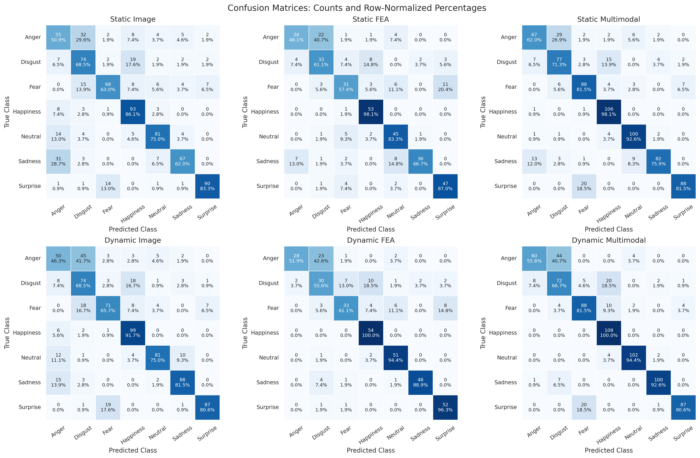

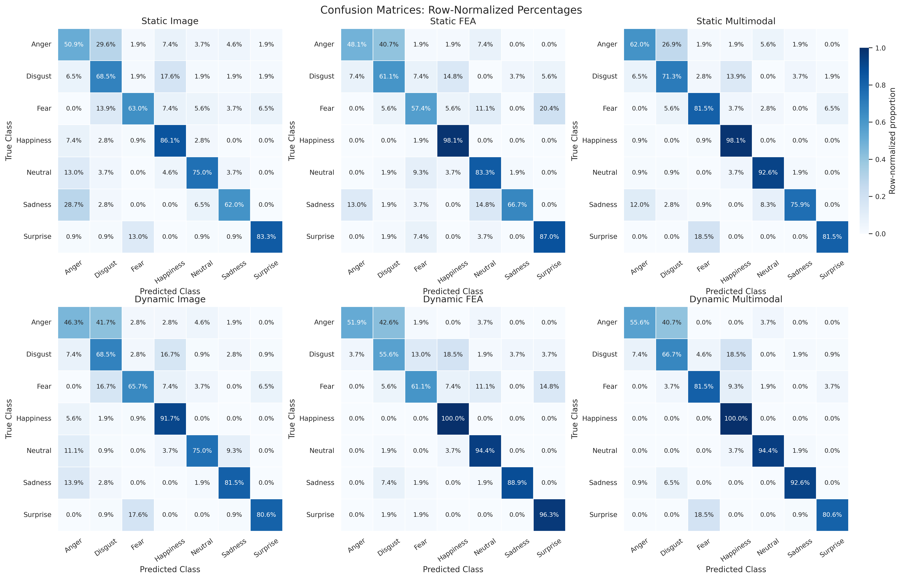

## 1. Overall Static → Dynamic changes

| Modality | Unit | Static Accuracy | Dynamic Accuracy | Δ Accuracy | Static Macro-F1 | Dynamic Macro-F1 | Δ Macro-F1 |
| --- | --- | --- | --- | --- | --- | --- | --- |
| Image | view sample | 69.84% | 72.75% | +2.91 pp | 70.06% | 72.87% | +2.81 pp |
| FEA | reenactment | 71.69% | 78.31% | +6.61 pp | 71.10% | 77.74% | +6.64 pp |
| Multimodal | view sample | 80.42% | 81.61% | +1.19 pp | 80.22% | 81.49% | +1.27 pp |

The overall pattern is consistent for Accuracy and Macro-F1. The evaluated Dynamic models show the largest Static–Dynamic gain for **FEA** (**+6.61 pp Accuracy; +6.64 pp Macro-F1**), followed by **Image** (**+2.91; +2.81 pp**) and **Multimodal** (**+1.19; +1.27 pp**).

At sample level, Dynamic FEA corrects **41** reenactments that Static FEA misses while losing **16** previously correct reenactments. Dynamic Image corrects **98** view samples and loses **76**; Dynamic Multimodal corrects **65** and loses **56**.

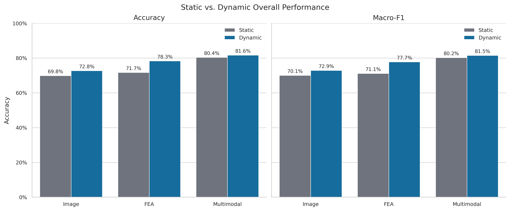

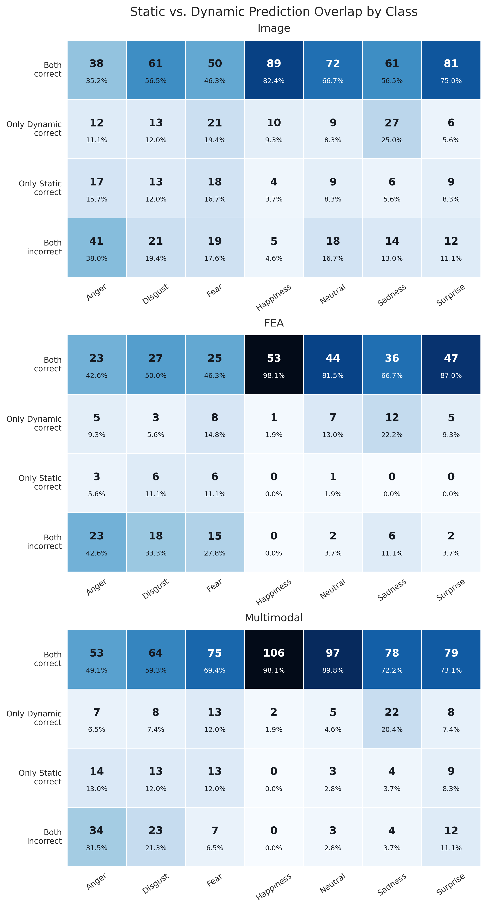

## 2. Class-level Static → Dynamic changes

| Modality | Class | Recall Δ | F1 Δ |
| --- | --- | --- | --- |
| Image | Anger | -4.63 pp | +1.14 pp |
| Image | Disgust | +0.00 pp | -2.94 pp |
| Image | Fear | +2.78 pp | -0.48 pp |
| Image | Happiness | +5.56 pp | +5.32 pp |
| Image | Neutral | +0.00 pp | +4.18 pp |
| Image | Sadness | +19.44 pp | +12.86 pp |
| Image | Surprise | -2.78 pp | -0.41 pp |
| FEA | Anger | +3.70 pp | +9.52 pp |
| FEA | Disgust | -5.56 pp | -5.67 pp |
| FEA | Fear | +3.70 pp | +7.26 pp |
| FEA | Happiness | +1.85 pp | -0.51 pp |
| FEA | Neutral | +11.11 pp | +13.07 pp |
| FEA | Sadness | +22.22 pp | +14.89 pp |
| FEA | Surprise | +9.26 pp | +7.92 pp |
| Multimodal | Anger | -6.48 pp | -0.22 pp |
| Multimodal | Disgust | -4.63 pp | -7.47 pp |
| Multimodal | Fear | +0.00 pp | +0.71 pp |
| Multimodal | Happiness | +1.85 pp | -2.30 pp |
| Multimodal | Neutral | +1.85 pp | +5.95 pp |
| Multimodal | Sadness | +16.67 pp | +11.07 pp |
| Multimodal | Surprise | -0.93 pp | +1.15 pp |

Recall and F1 provide complementary views. The strongest Recall changes are:

- **Image:** largest gain for **Sadness (+19.44 pp)**; largest decline for **Anger (-4.63 pp)**.
- **FEA:** largest gain for **Sadness (+22.22 pp)**; largest decline for **Disgust (-5.56 pp)**.
- **Multimodal:** largest gain for **Sadness (+16.67 pp)**; largest decline for **Anger (-6.48 pp)**.

The F1 deltas show whether those true-class gains or losses persist after accounting for false positives.

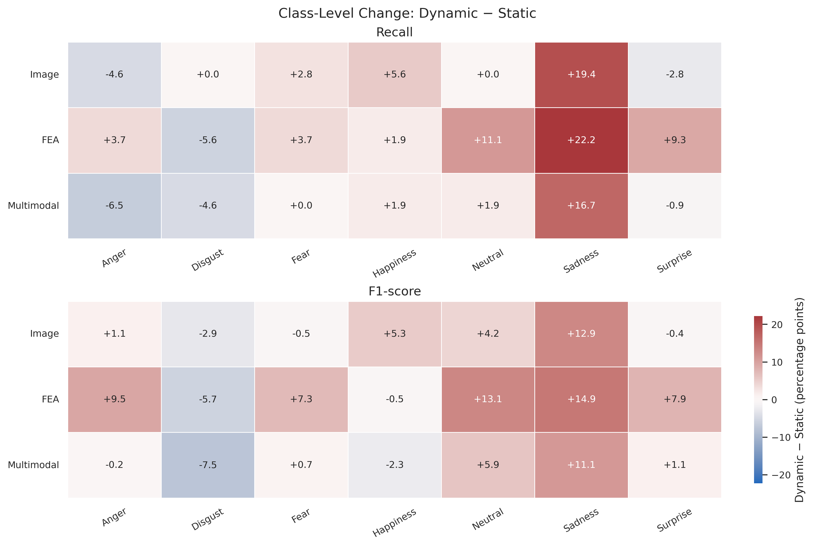

### Delta confusion matrices

The cell-wise Dynamic − Static comparison shows how predictions differ between the evaluated Static and Dynamic models. Positive diagonal values correspond to higher Dynamic recall; positive off-diagonal values correspond to newly increased error routes.

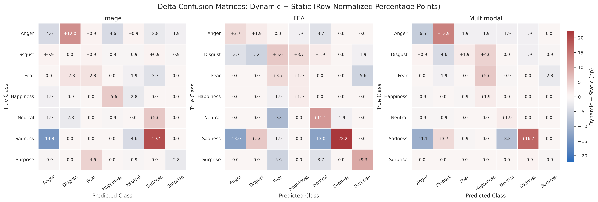

## 3. Persistent and changing error pairs

| Modality | Error | Count |
| --- | --- | --- |
| Image | Anger → Disgust | 45 |
| Image | Surprise → Fear | 19 |
| Image | Disgust → Happiness | 18 |
| Image | Fear → Disgust | 18 |
| Image | Sadness → Anger | 15 |
| FEA | Anger → Disgust | 23 |
| FEA | Disgust → Happiness | 10 |
| FEA | Fear → Surprise | 8 |
| FEA | Disgust → Fear | 7 |
| FEA | Fear → Neutral | 6 |
| Multimodal | Anger → Disgust | 44 |
| Multimodal | Disgust → Happiness | 20 |
| Multimodal | Surprise → Fear | 20 |
| Multimodal | Fear → Happiness | 10 |
| Multimodal | Disgust → Anger | 8 |

The dominant Dynamic Image error is **Anger → Disgust**, and the same confusion remains prominent for Dynamic FEA and Dynamic Multimodal. The evaluated Dynamic models change specific error routes rather than uniformly reducing all errors.

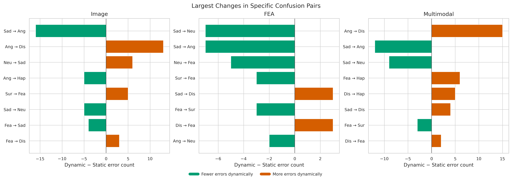

## 4. Comparisons within the Dynamic setting

| Comparison | Base | Target | Δ | Base-only correct | Target-only correct | Error rescue | Correct retention |
| --- | --- | --- | --- | --- | --- | --- | --- |
| Image → FEA | 72.75% | 78.31% | +5.56 pp | 74 | 116 | 56.31% | 86.55% |
| Image → Multimodal | 72.75% | 81.61% | +8.86 pp | 24 | 91 | 44.17% | 95.64% |
| FEA → Multimodal | 78.31% | 81.61% | +3.31 pp | 32 | 57 | 34.76% | 94.59% |

### Dynamic Image vs. Dynamic FEA complementarity

Dynamic FEA exceeds Dynamic Image by **+5.56 pp** on the aligned view rows. The overlap heatmap separates agreement from modality-specific correct decisions.

The strongest class-level Recall advantage for FEA over Image is **Neutral (+19.44 pp)**, whereas the strongest Image advantage over FEA is **Disgust (-12.96 pp)**. These asymmetric strengths provide a direct rationale for multimodal fusion.

### Dynamic Image / FEA vs. Multimodal

Dynamic Multimodal reaches the highest overall accuracy. Relative to Dynamic Image, Multimodal gains **+8.86 pp**, rescues **91** Image errors, and loses **24** Image-correct view samples. It retains **95.64%** of Image-correct cases.

Relative to Dynamic FEA, Multimodal gains **+3.31 pp** on the aligned view rows, rescues **57** FEA-wrong rows, and loses **32** FEA-correct rows. These are descriptive view-row counts.

### Class-level change when moving to Multimodal

| Comparison | Class | Recall Δ | F1 Δ |
| --- | --- | --- | --- |
| Image → Multimodal | Anger | +9.26 pp | +17.55 pp |
| Image → Multimodal | Disgust | -1.85 pp | +2.55 pp |
| Image → Multimodal | Fear | +15.74 pp | +10.37 pp |
| Image → Multimodal | Happiness | +8.33 pp | +3.90 pp |
| Image → Multimodal | Neutral | +19.44 pp | +13.85 pp |
| Image → Multimodal | Sadness | +11.11 pp | +10.88 pp |
| Image → Multimodal | Surprise | +0.00 pp | +1.29 pp |
| FEA → Multimodal | Anger | +3.70 pp | +1.13 pp |
| FEA → Multimodal | Disgust | +11.11 pp | +9.55 pp |
| FEA → Multimodal | Fear | +20.37 pp | +11.60 pp |
| FEA → Multimodal | Happiness | +0.00 pp | -0.70 pp |
| FEA → Multimodal | Neutral | +0.00 pp | +5.75 pp |
| FEA → Multimodal | Sadness | +3.70 pp | +1.59 pp |
| FEA → Multimodal | Surprise | -15.74 pp | -2.66 pp |

The Recall and F1 deltas show that Multimodal does not uniformly dominate both unimodal models. Some classes gain strongly from fusion, while others preserve a unimodal advantage.

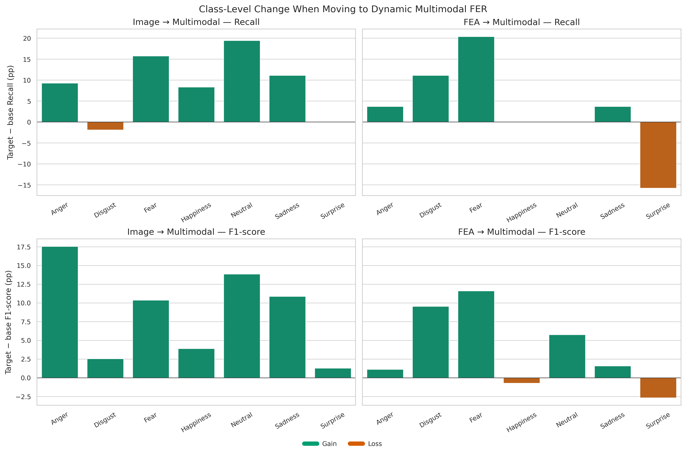

The net metric deltas can conceal substantial sample turnover. The gain/loss plot therefore shows the **absolute number of newly correct and newly incorrect samples per class**. A class can simultaneously gain Multimodal-correct samples and lose samples that the unimodal model previously classified correctly; the difference between those two counts produces the net Recall change.

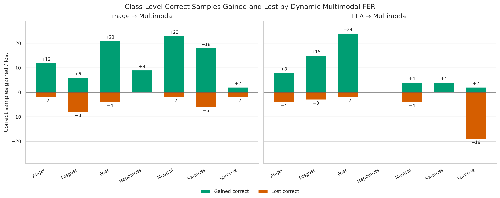

For the count-level **Multimodal − FEA** delta matrix, the FEA confusion matrix is view-aligned by doubling each reenactment-level count so that it matches the 756 multimodal view rows. This is descriptive only.

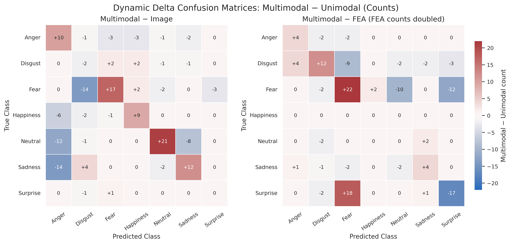

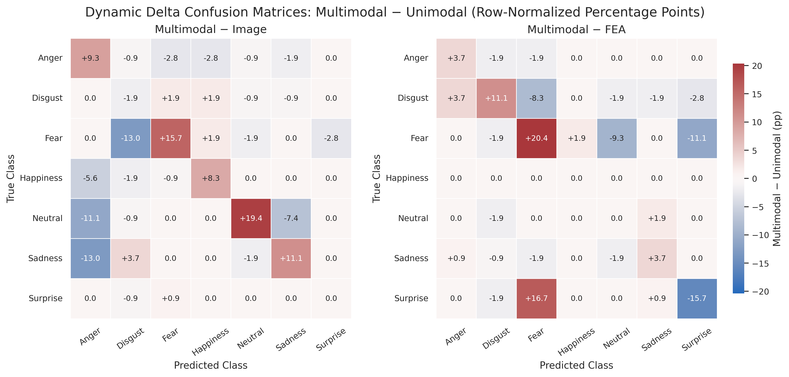

## 5. Sample-level review

The class-wise overlap heatmaps show that model improvements are mixtures of **rescued errors and newly introduced errors**:

- **Image vs. FEA** directly characterizes Dynamic unimodal complementarity.
- **Image → Multimodal** shows where fusion corrects Image-model errors and where it sacrifices already-correct Image predictions.
- **FEA → Multimodal** shows the same trade-off relative to the FEA model.
- **Both incorrect** identifies the residual cases that neither compared model resolves.

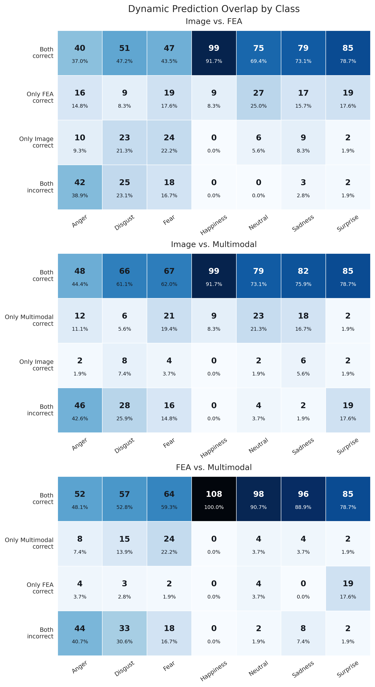

## 6. Fusion within the four unimodal correctness groups

The groups below are defined jointly by Image and FEA correctness, separately within each setting. Fusion is then evaluated within each group. Unlike the pairwise comparisons above, this directly separates preservation of jointly correct predictions, successful use of a class available from only one modality, and recovery when both unimodal predictions are wrong.

| Setting | Group | Group N | Fusion correct | Fusion wrong | Fusion accuracy within group |
| --- | --- | --- | --- | --- | --- |
| Static | Both correct | 414 | 411 | 3 | 99.28% |
| Static | Only Image correct | 114 | 95 | 19 | 83.33% |
| Static | Only FEA correct | 128 | 84 | 44 | 65.62% |
| Static | Both wrong | 100 | 18 | 82 | 18.00% |
| Dynamic | Both correct | 476 | 474 | 2 | 99.58% |
| Dynamic | Only Image correct | 74 | 52 | 22 | 70.27% |
| Dynamic | Only FEA correct | 116 | 86 | 30 | 74.14% |
| Dynamic | Both wrong | 90 | 5 | 85 | 5.56% |

The denominator of each percentage is **Group N**, not the full test set. All counts refer to aligned view rows; the FEA decision is repeated across its two views. Group membership changes between Static and Dynamic, so the conditional rates are descriptive and are not a paired test of improvement within a fixed subgroup.

Fusion preserves nearly all cases where both unimodal models are correct: **411/414** in Static and **474/476** in Dynamic, with **3** and **2** losses, respectively. It also recovers **18/100** Static and **5/90** Dynamic cases in which both unimodal models are wrong. A learned fusion model can therefore find a correct class that neither unimodal argmax selected.

### Decomposing the prediction-selection oracle gap

The prediction-selection oracle counts a case as correct whenever at least one unimodal prediction is correct. It is a descriptive reference, not a strict ceiling for learned fusion. The accounting identity is:

**Fusion correct = at least one unimodal correct − available correct class lost + both-wrong cases recovered.**

| Setting | At least one unimodal correct | Available correct class lost | Both-wrong cases recovered | Fusion correct |
| --- | --- | --- | --- | --- |
| Static | 656 | 66 | 18 | 608 |
| Dynamic | 666 | 54 | 5 | 617 |

This decomposition distinguishes missed available correct predictions from recoveries beyond unimodal prediction selection. It does not identify a causal fusion mechanism or establish that residual errors are perceptually ambiguous.

The overall table and descriptive breakdowns are exported as [overall groups](tables/fusion_correctness_groups.csv), [groups by true class](tables/fusion_correctness_groups_by_class.csv), and [groups by view](tables/fusion_correctness_groups_by_view.csv). Empty subgroups have undefined rates. Class and view breakdowns are exploratory and receive no additional significance tests.

### Overall fusion outcomes by correctness group

The bars show the proportion of correct and incorrect fusion predictions
within each unimodal correctness group. Group sizes and exact counts are
shown alongside the percentages.

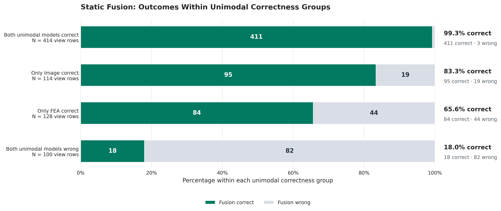

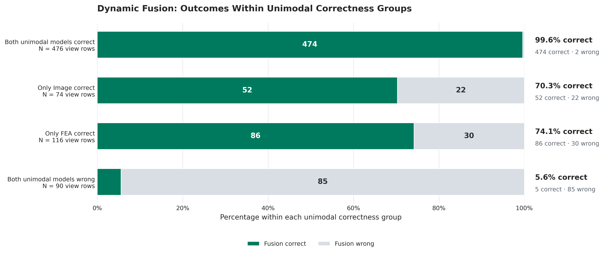

### Class-wise fusion outcomes by correctness group

Each heatmap cell reports fusion accuracy and the number of correct fusion predictions divided by the group size, conditional on both the unimodal correctness group and the true expression class. Both settings use the same color scale. Percentages are normalized within each cell and do not sum to 100% across rows or columns. Empty groups are marked explicitly; rates based on small groups should be interpreted cautiously.

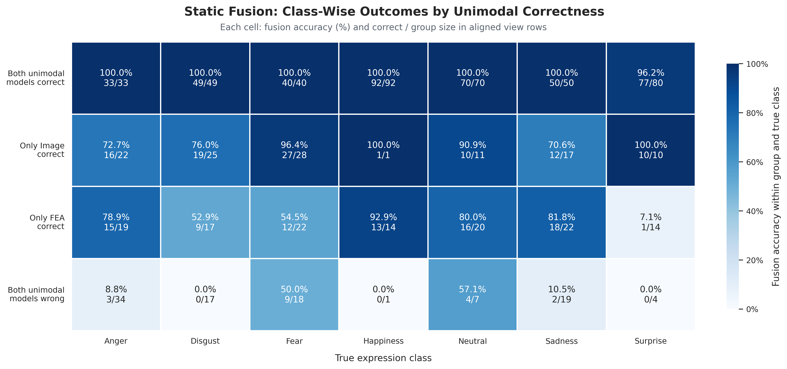

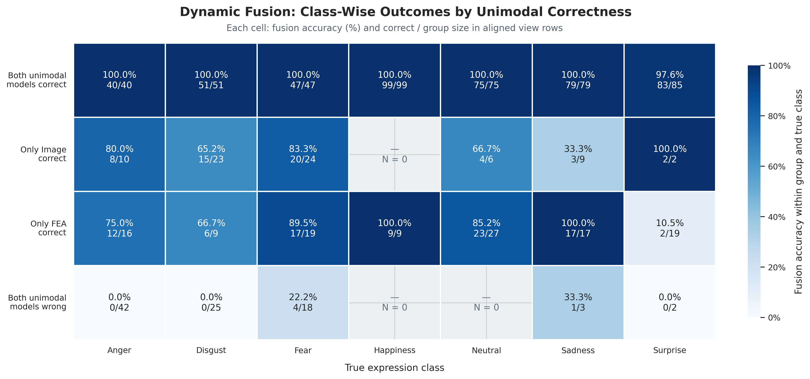

Static and Dynamic group memberships may differ, so differences between their conditional rates are descriptive rather than paired effects within a fixed subgroup.

## 7. Review

1. **Dynamic Multimodal achieves the highest overall performance among the evaluated dynamic models.** Accuracy reaches **81.61%**, compared with **72.75%** for Image and **78.31%** for FEA. Macro-F1 follows the same ordering: **81.49%**, **72.87%**, and **77.74%**, respectively. Fusion therefore improves accuracy by **8.86 percentage points over Image** and **3.31 pp over FEA**, with corresponding Macro-F1 gains of **8.62 pp** and **3.75 pp**. The agreement between these metrics indicates that the overall advantage also appears in the class-averaged balance of precision and recall. See the [dynamic performance overview](figures/07_dynamic_modality_performance.png).
2. **The dynamic unimodal models provide complementary correct predictions.** Across the **756 aligned view rows**, both models are correct in **476** cases, only Image in **74**, only FEA in **116**, and neither in **90**. Exactly one modality is therefore correct in **190 cases (25.13%)**, providing substantial scope for fusion. Their class strengths also differ: FEA exceeds Image recall for **Neutral by 19.44 pp**, whereas Image exceeds FEA recall for **Disgust by 12.96 pp**. Thus, FEA's higher overall accuracy does not make Image redundant: Image correctly classifies cases and class-specific patterns that FEA misses. See the [dynamic prediction-overlap heatmaps](figures/09_dynamic_modality_prediction_overlap.png) and [class-wise comparison table](tables/dynamic_pairwise_class_comparison.csv).
3. **Fusion preserves nearly all jointly correct predictions and resolves most cases where only one unimodal model is correct.** Dynamic Multimodal retains **474/476 jointly correct cases (99.58%)**, introducing only **two** errors in this group. It also correctly classifies **52/74 Image-only-correct cases (70.27%)** and **86/116 FEA-only-correct cases (74.14%)**. Together, these results account for **138/190 correct fusion predictions (72.63%)** among cases with exactly one correct unimodal prediction. This demonstrates successful use of complementary information at the prediction level, although it does not establish how the fusion model internally weights or selects information from either modality. See the [dynamic fusion-group plot](figures/15_dynamic_fusion_correctness_groups.png) and [four-group table](tables/fusion_correctness_groups.csv).
4. **The gains involve both error recovery and losses of previously correct predictions.** Relative to Image, fusion corrects **91/206 errors (44.17%)** but loses **24/550 correct predictions (4.36%)**, yielding a net gain of **67 correct view predictions**. Relative to FEA, it corrects **57/164 wrong view rows (34.76%)** and loses **32/592 correct rows (5.41%)**, yielding a net gain of **25**. The overall accuracy differences therefore conceal substantial changes in which samples are classified correctly. These counts also show that the fusion model does not simply preserve every unimodal success while adding new ones. See the [class-wise gain/loss plots](figures/08b_dynamic_multimodal_gain_loss_counts.png) and [sample-level transitions](tables/dynamic_pairwise_sample_transitions.csv).
5. **Fusion benefits some classes strongly while sacrificing advantages of a unimodal model for others.** For **Fear**, fusion recall reaches **81.48%**, compared with **65.74%** for Image and **61.11%** for FEA; F1 improves by **10.37 pp** and **11.60 pp**, respectively. The joint-group analysis shows that fusion retains all **47** jointly correct Fear cases, correctly classifies **20/24 Image-only** and **17/19 FEA-only** cases, and recovers **4/18 jointly incorrect** cases. In contrast, **Surprise** recall declines from **96.30% for FEA to 80.56% for fusion**, with an F1 decline of **2.66 pp**. Here, fusion correctly classifies only **2/19 cases where FEA alone is correct**, identifying a specific failure to preserve useful unimodal predictions. See the [class-level metric changes](figures/08_dynamic_multimodal_class_recall_deltas.png) and [dynamic class-wise fusion-group heatmap](figures/17_dynamic_fusion_correctness_groups_by_class.png).
6. **Recall alone does not capture all changes introduced by fusion.** For **Neutral**, FEA and Multimodal both achieve **94.44% recall**, but precision increases from **83.61% to 94.44%**, raising F1 by **5.75 pp**. Fusion therefore reduces false-positive Neutral predictions while retaining the same number of correctly recognized Neutral cases. Conversely, for **Disgust**, fusion recall is **1.85 pp lower than Image recall**, while precision improves by **5.30 pp** and F1 by **2.55 pp**. These examples explain why recall-based overlap and confusion analyses should be interpreted alongside precision and F1. See the [class-wise comparison table](tables/dynamic_pairwise_class_comparison.csv) and [Multimodal–Unimodal delta confusion matrices](figures/13_dynamic_multimodal_unimodal_confusion_delta_normalized.png).
7. **Fusion occasionally recovers cases where both unimodal models fail, but shared failures remain a major limitation.** Dynamic Multimodal correctly classifies **5/90 jointly incorrect cases (5.56%)**: **four Fear cases and one Sadness case**. It recovers none of the **42 Anger** or **25 Disgust** cases in this group. Consistent with these persistent failures, **Anger → Disgust** remains the largest dynamic confusion, occurring in **45/108 Image cases**, **23/54 unique FEA cases**, and **44/108 Multimodal cases**. These results identify shared prediction weaknesses, but do not establish that the expressions themselves are inherently ambiguous or identify the visual or FEA features responsible. See the [six-setting confusion matrices](figures/01_confusion_matrices_counts.png) and [class-wise fusion-group table](tables/fusion_correctness_groups_by_class.csv).
8. **The prediction-selection oracle gap separates missed available successes from additional fusion recoveries.** At least one dynamic unimodal model is correct in **666/756 cases (88.10%)**, whereas fusion is correct in **617/756 (81.61%)**. The difference can be decomposed as **666 − 54 + 5 = 617**: fusion loses **54 cases where a correct unimodal prediction was available**, but recovers **five cases where neither unimodal prediction was correct**. The resulting **6.48 pp gap** therefore reflects the balance of these two effects. Because fusion can recover jointly incorrect cases, the prediction-selection oracle is a descriptive reference rather than a strict ceiling for learned fusion. See the oracle-gap decomposition in Section 6 and the [four-group results](tables/fusion_correctness_groups.csv).

All findings in this section describe the evaluated models and test set. Cross-modality counts use aligned view rows, with each FEA prediction repeated for Central and Side; these are not 756 independent FEA observations. Class-conditional percentages should be read together with their group sizes, particularly for small or empty groups.

## Interpretation guardrails

- These are descriptive prediction/error analyses; significance claims should come from the dedicated statistical-test notebooks.
- FEA-only analyses use 378 unique reenactment predictions. Cross-modality view-row comparisons duplicate each FEA decision across Central and Side and therefore must not be interpreted as 756 independent FEA observations.
- Reenactments from the same participant may be dependent. Deduplicating the two FEA view rows does not establish independence among the 378 reenactments from eight participants.
- Static–Dynamic comparisons describe these fitted models. They do not isolate chronological order from other architectural or training differences; the separate Ordered–Shuffled/Mean ablations address the order-versus-aggregation question.
- No participant image examples are included, in accordance with the privacy constraint. Aggregate error patterns do not establish visual causes or human label ambiguity.
- Differences in confusion counts reflect the fixed test set and should not be generalized beyond it without the accompanying inferential analyses.
